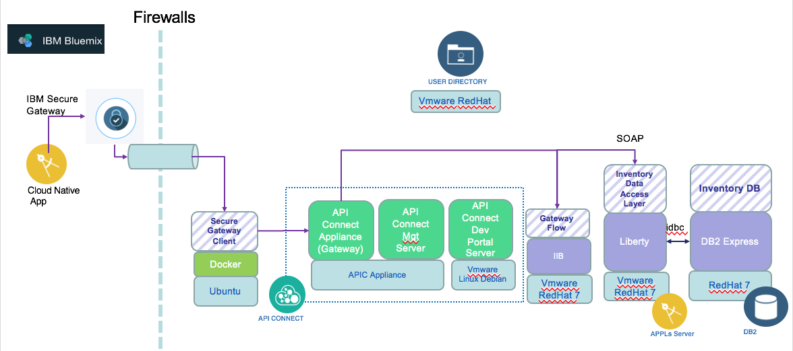

# Hybrid Integration Reference Architecture

## Architecture
This project provides a reference implementation for building an hybrid integration solution, using cloud native  web application, connected via IBM secure gateway to an enterprise inventory database running on-premise server. The logical architecture for this reference implementation is shown in the picture below.


It is important to note that the development approach on the back-end is to sue Service Oriented Architecture, with ESB pattern and SOAP interface. One of the goal of this implementation is to reflect what is commonly found in IT landscape in 2017.

For information of the Hybrid architecture, visit the [Architecture Center - Hybrid Architecture](https://www.ibm.com/devops/method/content/architecture/hybridArchitecture#0_1)

## Application Overview
The application is an extension of the "CASE.inc" retail store introduced in [cloud native](https://github.com/ibm-cloud-architecture/refarch-cloudnative) but for internal users who want to manage the inventory items for the retail shop. The data base is a simple inventory DB with products, supplier and stock information. A Data Access Layer component, based on JAXWS, produces a set of SOAP operations to be used as part of a SOA strategy. The new user interface is developed using Angular 2, nodejs/express on Bluemix, and remote access the data source via IBM Secure Gateway. As part of the IT strategy, the inventory SOAP operations are exposed as APIs using API Connect. The component and physical deployment looks like the image below:



## Project Repositories
This project leverages other projects by applying clear separation of concerns design, n-tiers architecture, and service oriented architecture.

* [Data Access Layer](https://github.com/ibm-cloud-architecture/refarch-integration-inventory-dal) to deliver SOAP interface for Inventory management. JAXWS / JPA app.
* [DB2](https://github.com/ibm-cloud-architecture/refarch-integration-inventory-db2) to support scripting and ddl for Inventory DB.
* [APIC Connect](https://github.com/ibm-cloud-architecture/refarch-integration-api) Content for the Inventory API definition and management
* [Inventory Portal](https://github.com/ibm-cloud-architecture/refarch-integration-app) Cloud native application to manage the inventory and serve as internal portal.
* [Testing](https://github.com/ibm-cloud-architecture/refarch-integration-tests) This repository includes a set of test cases to do component testing, functional testing and integration tests.
* [Case Inc Internal Portal](https://github.com/ibm-cloud-architecture/refarch-caseinc-app) Portal web app to expose access and user interface for inventory DB.


## Run the reference application locally and on IBM Bluemix
To run the sample application you will need to configure your Bluemix environment for the WebApp front end, and use a skytap environment for all the on-premise servers...

## Step 1: Environment Setup
### Prerequisites
<TODO>

### Install the Bluemix CLI
As IBM Bluemix application, many commands will require the Bluemix CLI toolkit to be installed on your local environment. To install it, follow [these instructions](https://console.ng.bluemix.net/docs/cli/index.html#cli)

The following steps use the cf tool.

### Create a New Space in Bluemix

1. Click on the Bluemix account in the top right corner of the web interface.
2. Click Create a new space.
3. Enter "ra-hybrid-dev" for the space name and complete the wizard.

### Get application source code

Clone the base repository: ``` git clone https://github.com/ibm-cloud-architecture/refarch-integration.git```

Then using the command ``` ./clonePeers.sh ``` Clone the peer repositories.
