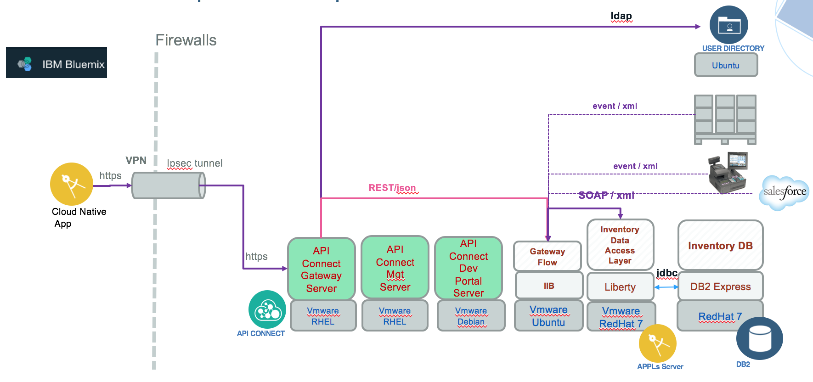

# Hybrid Integration Reference Architecture

IT environments are becoming hybrid in nature; most businesses use cloud computing as part of their overall IT environment. While businesses continue to operate enterprise applications, processes, and systems of record on premises, they are rapidly developing cloud-native applications on cloud. The hybrid integration reference architecture describes an approach to connect cloud and on-premises components together.

In this architecture, existing applications are moved to the infrastructure as a service (IaaS) of cloud providers. New applications are built on the cloud as a platform as a service (PaaS), using pre-built cloud-based software as a service (SaaS).
Hybrid integration has a vast scope addressing integration points like:
* Cloud native app and on-premise system of record, or business services
* on-premise business applications or processes with public cloud service
* SaaS application and cloud native app
* App on private cloud and on-premise app

Hybrid integration bridges data sources, applications or APIs wherever they might be on-premises, IaaS, PaaS or SaaS.   


This current project provides a reference implementation for building and running an **hybrid integration** solution, using cloud native web application securely connected to an enterprise data source and SOA services running on on-premise servers. This compute model, represents existing SOA / Traditional IT landscape with products such as ESB, BPM, Rule engine, and Java based web service applications or even event driven publisher.  One of the goal of this implementation is to reflect what is commonly found in IT landscape in 2017, and provides recommendations on how to manage hybrid architecture with the cloud programming model by addressing non-functional requirements as scalability, security, monitoring and resiliency.

## Table of Contents

* [Application Overview](https://github.com/ibm-cloud-architecture/refarch-integration#application-overview)  
* [Project Repositories](https://github.com/ibm-cloud-architecture/refarch-integration#project-repositories)  
* [Run the Brown Compute model](https://github.com/ibm-cloud-architecture/refarch-integration#run-brown-compute)  
  * [Step 1: Environment Setup](https://github.com/ibm-cloud-architecture/refarch-integration#step-1-environment-setup)
  * [Step 2: Provision Kubernetes Cluster on IBM Bluemix](https://github.com/ibm-cloud-architecture/refarch-integration#step-2-provision-kubernetes-cluster-on-ibm-bluemix)
  * [Step 3: Deploy to run on IBM Cloud Private](./docs/icp-deploy.md)
  * [Step 3': Deploy and run on Bluemix](https://github.com/ibm-cloud-architecture/refarch-integration#step-3-deploy-and-run)
* [Security](https://github.com/ibm-cloud-architecture/refarch-integration#security)
* [DevOps automation, Resiliency and Cloud Management and Monitoring](https://github.com/ibm-cloud-architecture/refarch-integration#devops-automation-resiliency-and-cloud-management-and-monitoring)

* [Contribute to the solution](https://github.com/ibm-cloud-architecture/refarch-integration#contribute)

# Application Overview
The front end business application is an extension of the "CASE.inc" retail store introduced in [cloud native](https://github.com/ibm-cloud-architecture/refarch-cloudnative) but dedicated for internal users who want to manage the inventory items of the retail shops/warehouses or wants to access other internal application. The data base is a simple inventory DB with products, supplier and stock information.

The end users will be able to authenticate to an internal LDAP, and access different capabilities like the **Inventory Plus** application manage items to resell on the public web page. To read a demonstration flow see the note [here](docs/brown-demo-flow.md)

A Data Access Layer component, based on JAXWS, produces a set of SOAP operations to be used as part of a SOA strategy defined early 2004. With new team in place a new user interface is developed using Angular 2, nodejs/express on Bluemix or on private cloud, as a containized nodejs app, and with remote access to on-premise data source via IBM Secure Gateway. As part of the new IT strategy, the inventory SOAP operations are exposed as RESTful APIs using API Connect so it can be easily consumed.

The component view and physical deployment for the first configuration looks like the image below:


* On the left side the Case Inc Portal app defines a set of user interface to manage Inventory elements, it is a modern Angular 4 / nodejs app which uses the [Back-end For Front-end pattern](http://philcalcado.com/2015/09/18/the_back_end_for_front_end_pattern_bff.html). The general-purpose API backend is implemented in ESB. The client specific APIs to serve the angular js app is done in this BFF component. The nodejs/expressjs accesses the REST api exposed by API Connect via a Secure Gateway service on bluemix which acts as a proxy. A second security configuration is to use VPN. This application is containized and deployable on Kubernetes cluster. See this [repo](https://github.com/ibm-cloud-architecture/refarch-caseinc-app)
* APIC Connect, installed on-premise, is used as gateway to the different API run times.
* IBM Integration Bus, to do interfaces mapping between the SOAP data access layer, implemented in Java, and the RESTful API exposed to the public applications. For detail see [this note](docs/iib.md)
* The connection is done via a VPN IPsec tunnel. As of now to make it simple we are using IBM Secure Gateway Client on a dedicated server. This server is called *BrownUtilityServer*. In future we will move to VPN connection.
* The database is running on DB2 and is not directly accessed from API connect, but applying SOA principles, it is accessed via a Data Access Layer app. The server is *BrownDB2*
* The Data Access Layer app is a JAXWS application running on WebSphere Liberty server. The server is *BrownLibertyAppServer*.

For information of the Hybrid architecture, visit the [Architecture Center - Hybrid Architecture](https://www.ibm.com/devops/method/content/architecture/hybridArchitecture#0_1) with some light changes in the diagram as illustrated below:  


## Project Repositories
This project leverages other projects by applying clear separation of concerns design, n-tiers architecture, and service oriented architecture.

* [Data Access Layer](https://github.com/ibm-cloud-architecture/refarch-integration-inventory-dal) to deliver SOAP interface for Inventory management. JAXWS / JPA app.
* [DB2](https://github.com/ibm-cloud-architecture/refarch-integration-inventory-db2) to support scripting and ddl for Inventory DB.
* [APIC Connect](https://github.com/ibm-cloud-architecture/refarch-integration-api) Content for the Inventory API definition and management
* [IIB](https://github.com/ibm-cloud-architecture/refarch-integration-esb) Gateway and orchestration flow
* [Testing](https://github.com/ibm-cloud-architecture/refarch-integration-tests) This repository includes a set of test cases to do component testing, functional testing and integration tests.
* [Case Inc Internal Portal](https://github.com/ibm-cloud-architecture/refarch-caseinc-app) Portal web app to expose access and user interface for inventory DB.
* [Utility Server](https://github.com/ibm-cloud-architecture/refarch-integration-utilities) Server to manage a set of other components used for DevOps or connection like the secure gateway client.


# Deploy and Run
The 'top of the iceberg' for this solution implementation is the cloud native app 'Case Inc Portal' that offers accesses to the Inventory management and other features such as IT support chatbots. The details on how to build and run this application is [here.](https://github.com/ibm-cloud-architecture/refarch-caseinc-app)

To run the backend solution, we will deliver images for you to install on your servers... stay tuned, from now we are describing how each servers / code are configured in each of the specific github repository. We are using VmWare vSphere product to manage all the virtual machines. The figure below present the *Brown* Resource Pool.

## Prerequisites
* You need your own [github.com](http://github.com) account
* You need a git client code. For example for [Windows](https://git-scm.com/download/win) and for [Mac](https://git-scm.com/download/mac)
* Install [npm](https://www.npmjs.com/get-npm) and [nodejs](). Normally getting nodejs last stable version will bring npm too.
* You need to have some knowledge on using virtual machine images and tool like vSphere.

## The Current Physical Deployment and Installation
The  Current Physical deployment includes six servers, we are describing how installation was done in each matching project so you can replicate the configuration. It should take you 2 to 3 hours per server.
* DB2 server read [this note](https://github.com/ibm-cloud-architecture/refarch-integration-inventory-db2#db2-server-installation)
* Liberty App server read [this article](https://github.com/ibm-cloud-architecture/refarch-integration-inventory-dal/blob/master/docs/liberty-server.md)
* API Connect see [Server config](https://github.com/ibm-cloud-architecture/refarch-integration-api#server-configuration)
* For LDAP Server running on the utility server [LDAP Configuration](https://github.com/ibm-cloud-architecture/refarch-integration-utilities#ldap-configuration)
* [Utility Server](https://github.com/ibm-cloud-architecture/refarch-integration-utilities#server-configuration) running Secure Gateway and [Jenkins server](https://github.com/ibm-cloud-architecture/refarch-integration-utilities/blob/master/docs/cicd.md#installation)
As part of the Brown compute mission is to leverage the VM lift and shift approach by deploying vm image to Bluemix VM.

## Get application source code
Clone the base repository using git client:
```
git clone https://github.com/ibm-cloud-architecture/refarch-integration.git
```

Then under the refarch-integration folder use the command ``` ./clonePeers.sh ``` to clone the peer repositories of the 'Brown compute' solution.

And only for the first time use the ```./configureAll.sh``` script to perform the different dependency installations for the bluemix apps and other utilities.

### Working on your own
The script ` ./fork-repos.sh` should help you to fork all the repositories of this solution within your github account.

## Run on IBM Cloud Private
Under development [here](docs/icp-deploy.md)

## Run on Bluemix

You need to have a [Bluemix](http://bluemix.net) account, and know how to use cloud foundry command line interface and blumix container CLI to push to bluemix, the containized web application used to demonstrate the solution. Add a new space:
 1. Click on the Bluemix account in the top right corner of the web interface.
 2. Click Create a new space.
 3. Enter a name like "ra-integration" for the space name and complete the wizard steps.

### Step1: Install the different CLI needed
It includes bluemix, cf, and kubernetes. A script exists in this project for that see:  `./install_cli.sh`


### Step 2: Provision Kubernetes Cluster on IBM Bluemix
The kubernetes cluster is optional as the Case Inc Portal app can run in a docker container or as a cloud foundry application. We still encourage to use Kebernetes to deploy microservices as it offers a lot of added values we need. So if you want to deploy to Kubernetes you need to do the following instructions:
```
$ bx login
$ bx cs init
```
### Step 3: Deploy and run
There are multiple steps to make the solution working in the following order:
* Start DB2 server
* Start App server
* Start API Connect servers: Gateway, Management and Portal
* Start Utility server
* Start 'case inc' portal APP
* Run end to end validation testing with the [following script](https://github.com/ibm-cloud-architecture/refarch-integration-tests#integration-test)

Then the demonstration script follow the instructions [here](https://github.com/ibm-cloud-architecture/refarch-caseinc-app/blob/master/docs/demoflow.md)

For demonstration purpose not all back end servers are set in high availability.
The [testing project](https://github.com/ibm-cloud-architecture/refarch-integration-tests) implements a set of test cases to validate each of the component of this n-tier architecture.

# Security
Multiple security concerns are addressed by the **Brown compute** model. The first one is to support the deployment of private on-premise LDAP directory. The installation and configuration of the Open LDAP on the Utility server is described [here](https://github.com/ibm-cloud-architecture/refarch-integration-utilities#ldap-configuration).
Second one, to control the access from a Bluemix app, we first implemented an adhoc solution by exposing a /login path in API Connect. See explanation [here](https://github.com/ibm-cloud-architecture/refarch-caseinc-app/blob/master/docs/login.md#api-definition-on-back-end) on how we did it.  
The connection between the web app, front end of **Brown compute** and the back end is done over TLS socket, we present a quick summary of TLS and how TLS end to end is performed in [this article](https://github.com/ibm-cloud-architecture/refarch-integration/blob/master/docs/TLS.md)
The front end login mechanism on how we support injecting secure token for API calls is documented [here](https://github.com/ibm-cloud-architecture/refarch-caseinc-app/blob/master/docs/login.md)

### Add a IBM Secure Gateway Bluemix Service
To authorize the web application running on Bluemix to access the API Connect gateway running on on-premise servers (or any end-point on on-premise servers), we use the IBM Secure Gateway product and the bluemix Secure Gateway service: the configuration details and best practices can be found in this [article](https://github.com/ibm-cloud-architecture/refarch-integration-utilities/blob/master/docs/ConfigureSecureGateway.md)


# DevOps automation, Resiliency and Cloud Management and Monitoring
* DevOps   
You can setup and enable automated CI/CD for most of the *Brown Compute* components using Jenkins and Urban Code Deploy deploy on-premise. For detail, please check the Utility project [CI/CD notes](https://github.com/ibm-cloud-architecture/refarch-integration-utilities/blob/master/docs/cicd.md).

* Cloud Management and monitoring   
For guidance on how to manage and monitor the *Brown Compute* solution, please check the Management and Monitoring project.

* Making the Portal App Resilient   
Please check this repository on instructions and tools to improve availability and performances of the *Brown Compute* front end application.

* Secure The Application   
Please review the [TLS article](docs/TLS.md) on how we secure the solution end-to-end.


# Compendium
Architecture discussion on hybrid integration:
* How to ensure your integration landscape keeps pace with digital transformation article: [The evolving hybrid integration reference architecture](https://www.ibm.com/developerworks/library/mw-1606-clark-trs/index.html)
* How the 12 factors to measure component for cloud native app and micro service apply to hybrid integration: [The 12 factors integration](https://developer.ibm.com/integration/blog/2017/04/16/12-factor-integration/)
Product related knowledge based:
* API Connect
* IIB

# Contribute
We welcome your contribution. There are multiple ways to contribute: report bugs and improvement suggestion, improve documentation and contribute code.
We really value contributions and to maximize the impact of code contributions we request that any contributions follow these guidelines
* Please ensure you follow the coding standard and code formatting used throughout the existing code base
* All new features must be accompanied by associated tests
* Make sure all tests pass locally before submitting a pull request
* New pull requests should be created against the integration branch of the repository. This ensures new code is included in full stack integration tests before being merged into the master branch.
* One feature / bug fix / documentation update per pull request
* Include tests with every feature enhancement, improve tests with every bug fix
* One commit per pull request (squash your commits)
* Always pull the latest changes from upstream and rebase before creating pull request.

If you want to contribute, start by using git fork on this repository and then clone your own repository to your local workstation for development purpose. Add the up-stream repository to keep synchronized with the master.
