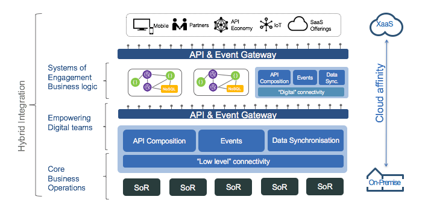
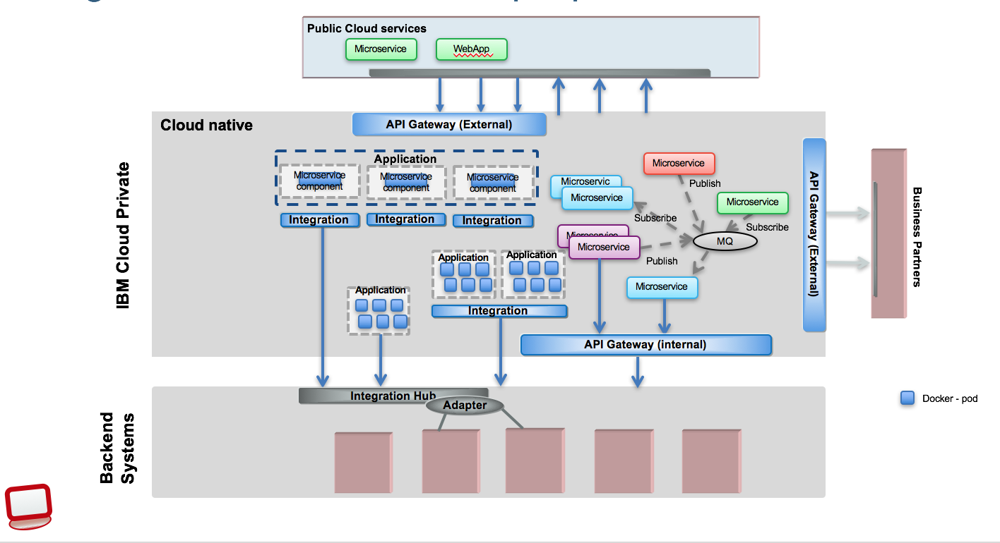
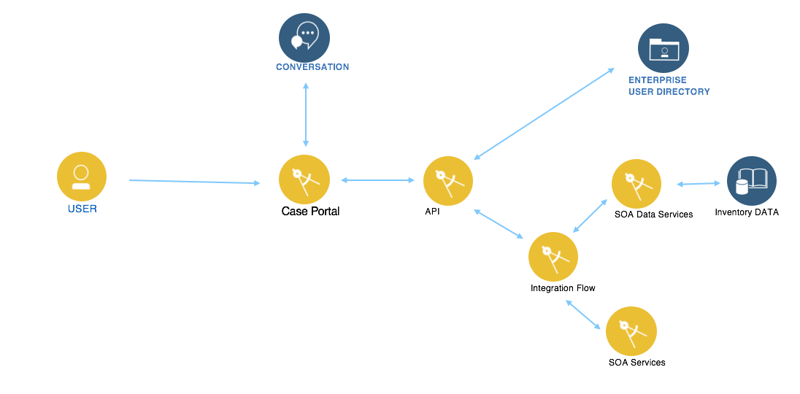
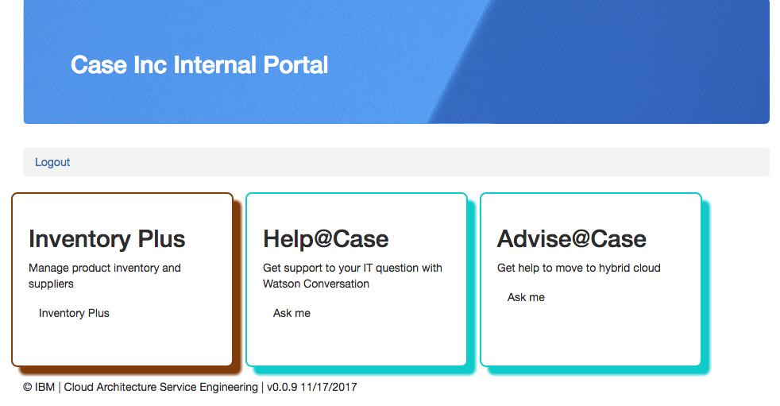
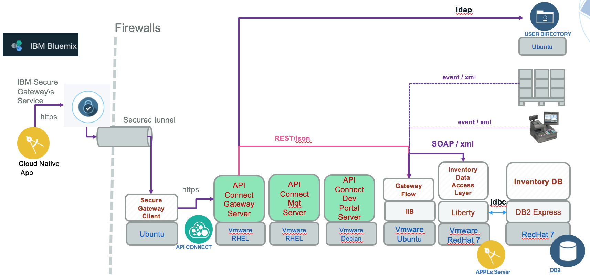
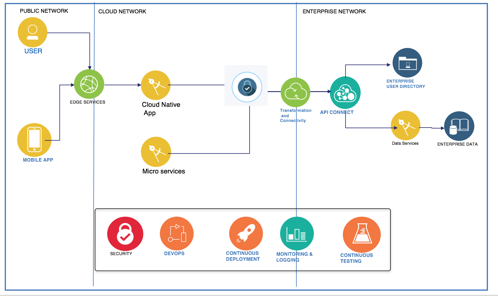
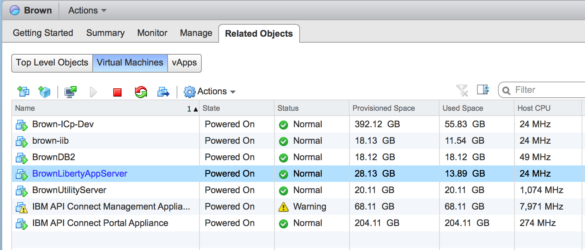

# Hybrid Integration Reference Architecture

IT environments are becoming hybrid in nature; most businesses use cloud computing as part of their overall IT environment. While businesses continue to operate enterprise applications, processes, and systems of record on premises, they are rapidly developing cloud-native applications on cloud. The [hybrid integration reference architecture](https://www.ibm.com/cloud/garage/content/architecture/integrationServicesDomain/) describes an approach to connect components which are split across cloud and on-premises environments, or across public and private clouds -- even across different cloud providers.

In this architecture, existing applications are moved to the infrastructure as a service (IaaS) of cloud providers. New applications are built on the cloud as a platform as a service (PaaS), using pre-built cloud-based software as a service (SaaS).

Hybrid integration has a vast scope addressing integration points like:
* Cloud native app and on-premise system of record, or business SOA services
* On-premise business applications or processes with public cloud services
* SaaS applications and cloud native app
* Applications developed and running on private cloud and on-premise app
* Application components running on different service providers
* Internet of things generating events, partially processed on public cloud, aggregated and persisted on-premise database, where analytics can be performed to classify the issue as risk, and trigger process for trouble shooting and maintenance.

Hybrid integration bridges data sources, applications or APIs wherever they might be on-premises, IaaS, PaaS or SaaS. The following diagram presents the high level view of the scope for an hybrid integration platform with API exposure, data integration, and different design styles of application integration.


It is important to note that any part of the architecture can be on-premises or fully cloud-based. Systems of records are more likely to be on-premises, but a new system of record might be deployed on a cloud infrastructure, or even be SaaS.

This current project provides a reference implementation for building and running an **hybrid integration** solution, using cloud native web application **securely** connected to an enterprise data source and SOA services running on on-premise servers. This compute model, represents existing SOA / Traditional IT landscape with products such as ESB, BPM, rule engine, and Java based web service applications or even event driven publisher.  One of the goal of this implementation is to reflect what is commonly found in IT landscape in 2017, and provides recommendations on how to manage hybrid architecture with the cloud programming model by addressing non-functional requirements as scalability, security, monitoring and resiliency.

## Table of Contents

* [Application Overview](#scope-overview)  
* [What you will learn](#what-you-will-learn)
* [Project Repositories](#project-repositories)  
* **Build and run the Hybrid Integration Compute model**
  * [Environment Setup](#the-current-physical-deployment-and-installation)
  * [Build and run](#build-and-run)
  * [Deployment to IBM Cloud Private](./docs/icp/README.md)
  * [Deployment to IBM Cloud Container Service IBM Cloud](./docs/run-bmx-cs.md)
  * [Deploy on IBM Cloud Cloud Foundry](./docs/run-bmx-cf.md)
* [Methodology](#methodology)
* [Security](#security)
* [DevOps / CI/CD](docs/devops/README.md)
* [Resiliency / HA / DR](#resiliency)
* [Hybrid Service Management and Operations](.docs/csmo/README.md)
* [Compendium](./docs/compendium.md)
* [Contribute to the solution](#contribute)

## Target audiences
* Architects who want to deeply understand how all the components work together, and how to support the non-functional requirements
* Developers who want to understand best practices for implementation, logging, devops, testing.
* Project managers to understand all the artifacts to be included in an hybrid integration solution

## What you will learn
By studying this set of projects and articles you will learn:
- how to develop a [SOAP app in Java](https://github.com/ibm-cloud-architecture/refarch-integration-inventory-dal#code-explanation) using JPA, JAXWS deployed on WebSphere Liberty
- how to develop [gateway message flow](https://github.com/ibm-cloud-architecture/refarch-integration-esb#inventory-flow) with IBM Integration Bus
- how to define [API product](https://github.com/ibm-cloud-architecture/refarch-integration-api#implementation-details) with API Connect, and use secure communication with TLS
- how to set up secure connection from public cloud to on-premise service
- how to develop a [Angular 4 app](https://github.com/ibm-cloud-architecture/refarch-caseinc-app#code-explanation) with nodejs/expressjs back end
- how to [secure the web app with passport](https://github.com/ibm-cloud-architecture/refarch-caseinc-app/blob/master/docs/login.md)
- how to access existing LDAP service for user authentication
- how to proxy requests to IBM Secure gateway to secure connection between public cloud and private servers
- how to perform CI/CD in hybrid world
- how to monitor all those components using Application Performance Monitoring
- how to deploy most of the components of the solution to IBM Cloud Private
- how to adopt a test focus implementation

# Scope Overview
As an hybrid cloud implementation the set of projects of this solution cover different functional requirements:
* [Inventory management](https://github.com/ibm-cloud-architecture/refarch-integration#inventory-management) a simple item inventory catalog deployed in DB2, with a SOAP data access layer, and IIB gateway flow and an API product defined in API Connect
* [IT Support bot or Help@Case](https://github.com/ibm-cloud-architecture/refarch-cognitive-conversation-broker) a set of bots implemented in Watson Conversation
* [Customer management for analytics](https://github.com/ibm-cloud-architecture/refarch-integration-services) is a set of function to manage customer, account and usage (telecom) for churn assessment.

In the longer term the brown compute will support this multiple patterns view:



where cloud native applications deployed on public cloud can access on-premise resource deployed on IBM cloud private or more traditional IT. Where cloud native applications are deployed on ICP, using integration microflows, and where micro services are part of event driven pattern, pub/sub or queues, where API definition exposes product for the public consumers or internal consumers and even business partner channels.

As of December 2017, public webapp accessing backend is supported, and private webapp on ICP are also supported see [this note](docs/icp/README.md)

## System context
The following diagram illustrates the logical components involved in the current solution:  


* [Web App "Case Portal"](https://github.com/ibm-cloud-architecture/refarch-caseinc-app) Portal web app to expose access and user interface to different applications.
* Interaction APIs to expose API products for public WebApp consumptions. Those APIs support specific resources needed by user interface app and channels they serve.
* System API to define backend service API product, used by multiple consumers.
* Integration Bus to connect to deep back end systems and SOA services, and do interface mapping and [mediation flows](https://github.com/ibm-cloud-architecture/refarch-integration-esb).
* [Watson conversation broker micro service](https://github.com/ibm-cloud-architecture/refarch-cognitive-conversation-broker) to facade and implement orchestration and business logic for chatbots using Watson Conversation.
* Decision engine to automate business rules execution and Management
* [Data SOA Java WS service](https://github.com/ibm-cloud-architecture/refarch-integration-inventory-dal) to expose a data access layer on top of relational item, inventory, supplier database
* LDAP for user Management

## User interface
To demonstrate the set of features of this solution , a front end application, representing an internal portal user interface, is used to plug and play the different use cases.

  

This front end application is an extension of the "CASE.inc" retail store introduced in [cloud native solution or "Blue compute"](https://github.com/ibm-cloud-architecture/refarch-cloudnative) which manages old computers, extended with IT support chat bot and other goodies.

The end users will be able to authenticate to an internal LDAP.

## Inventory management
This component is dedicated to the internal users who want to manage the inventory items of the retail shops/warehouses. The data base is a simple inventory DB with products, supplier and stock information.

**Inventory Plus** is the application that illustrates hybrid integration by consuming back-end services running on-premise servers. The component view and physical deployment for the IBM Cloud to on-premise servers configuration looks like the image below:


From left to right:
* The [Case Inc Portal app](https://github.com/ibm-cloud-architecture/refarch-caseinc-app) defines a set of user interface to manage Inventory elements, it is a modern Angular 4 / nodejs app which uses the [Back-end For Front-end pattern](http://philcalcado.com/2015/09/18/the_back_end_for_front_end_pattern_bff.html).
 The general-purpose API backend is implemented in ESB running on-premise. The client specific APIs to serve the Angular js app are done in this BFF component.

* The nodejs/expressjs accesses the REST api exposed by API Connect via a [Secure Gateway service](https://github.com/ibm-cloud-architecture/refarch-integration-utilities/blob/master/docs/ConfigureSecureGateway.md) on IBM Cloud which acts as a proxy or via direct VPN connection. This application is containized and deployable on Kubernetes cluster. See [this repository.](https://github.com/ibm-cloud-architecture/refarch-caseinc-app)

* The connection between public cloud and internal IT resources, is done via a VPN IPsec tunnel or [IBM Secure Gateway](https://github.com/ibm-cloud-architecture/refarch-integration-utilities/blob/master/docs/ConfigureSecureGateway.md). As of now we are using IBM Secure Gateway Client on a dedicated server. This server is called [BrownUtilityServer and the installation and configuration is detailed here ](https://github.com/ibm-cloud-architecture/refarch-integration-utilities).

* [API Connect](https://github.com/ibm-cloud-architecture/refarch-integration-api), installed on-premise, is used as API gateway to the different API run times.

* [IBM Integration Bus](https://github.com/ibm-cloud-architecture/refarch-integration-esb), is used to do interfaces mapping between the SOAP data access layer, implemented in Java, and the RESTful API exposed to the public applications. For detail see [this note](docs/iib.md)

* The **Data Access Layer** is a JAXWS application running on WebSphere Liberty server and exposing a set of SOAP services. The server is *BrownLibertyAppServer*. See [this repository](https://github.com/ibm-cloud-architecture/refarch-integration-inventory-dal) for detail.

* The inventory **database** is running on DB2 and is not directly accessed from API connect, but applying SOA principles, it is accessed via a Data Access Layer app. The server is *BrownDB2*.

This set of projects are implementing the Hybrid integration reference architecture described in IBM [Architecture Center - Hybrid Architecture](https://www.ibm.com/cloud/garage/content/architecture/hybridArchitecture) with some light changes as illustrated below:    

* API Connect runs on premise
* ESB is used to manage all SOA services
* VPN or Secure Gateway are used to open secure tunneling between public cloud deployed applications and on-premise services.

The current implementation can run on private cloud and we are presenting this deployment in detail in [this article](docs/icp/README.md).

# Project Repositories
This project leverages a set of projects by applying clear separation of concerns design, n-tiers architecture, and service oriented architecture. The repository order is from left to right from previous diagram.

* [Case Inc Internal Portal](https://github.com/ibm-cloud-architecture/refarch-caseinc-app) Portal web app to expose access and user interface for inventory DB.
* [Utility Server](https://github.com/ibm-cloud-architecture/refarch-integration-utilities) Server used to manage secure connection with [IBM Secure Gateway](https://console.bluemix.net/docs/services/SecureGateway/secure_gateway.html) client.
* [APIC Connect](https://github.com/ibm-cloud-architecture/refarch-integration-api) Content for the Inventory API definition and management
* [IBM Integration Bus - Inventory gateway flow](https://github.com/ibm-cloud-architecture/refarch-integration-esb) Gateway and orchestration flow
* [Data Access Layer](https://github.com/ibm-cloud-architecture/refarch-integration-inventory-dal) to deliver SOAP interface for Inventory management. JAXWS / JPA app.
* [DB2](https://github.com/ibm-cloud-architecture/refarch-integration-inventory-db2) to support scripting and ddl for Inventory DB.

* [Testing](https://github.com/ibm-cloud-architecture/refarch-integration-tests) This repository includes a set of test cases to do component testing, functional testing and integration tests.


# Build and Run
The 'top of the iceberg' for this solution implementation is the cloud native app 'Case Inc Portal' that offers accesses to the Inventory management and other features such as IT support chatbot. The details on how to build and run this web application is [here.](https://github.com/ibm-cloud-architecture/refarch-caseinc-app)

To run the backend solution, we will deliver images for you to install on your servers... stay tuned, from now we are describing how each server is configured in each of the specific github repository. We are using VmWare vSphere product to manage all the virtual machines. The figure below presents the *Brown* Resource Pool with the current servers:   


## Prerequisites
* You need your own [github.com](http://github.com) account
* You need a git client code. For example for [Windows](https://git-scm.com/download/win) and for [Mac](https://git-scm.com/download/mac)
* Install [npm](https://www.npmjs.com/get-npm) and [nodejs](https://nodejs.org). Normally getting nodejs last stable version will bring npm too.
* You need to have some knowledge on using virtual machine images and tool like vSphere.
* As we are migrating to IBM Cloud Private a set of components run as docker container in pods.

## The Current Physical Deployment and Installation
The  Current Physical deployment includes six servers, we are describing how installations were done in separate git hub repository so you can replicate the configuration if you want. It should take you 1 to 2 hours per server.
As an alternate and easier approach we are delivering a Vagrant file and explanation on how to use it [here](vm/README.md)
* DB2 server read [this note](https://github.com/ibm-cloud-architecture/refarch-integration-inventory-db2#db2-server-installation)
* Liberty App server read [this article](https://github.com/ibm-cloud-architecture/refarch-integration-inventory-dal/blob/master/docs/liberty-server.md)
* IBM Integration Bus see [this article]().
* API Connect see [Server config](https://github.com/ibm-cloud-architecture/refarch-integration-api#server-configuration)
* Open LDAP Server running on the utility server [LDAP Configuration](https://github.com/ibm-cloud-architecture/refarch-integration-utilities#ldap-configuration)
* [Utility Server](https://github.com/ibm-cloud-architecture/refarch-integration-utilities#server-configuration) runs IBM Secure Gateway and [Jenkins server](https://github.com/ibm-cloud-architecture/refarch-integration-utilities/blob/master/docs/cicd.md#installation)  

As part of the hybrid integration compute mission is to leverage the VM lift and shift approach by deploying vm image to IBM Cloud VM.

## Get application source code
Clone this base repository using git client:
```
git clone https://github.com/ibm-cloud-architecture/refarch-integration.git
```

Then under the refarch-integration folder use the command ``` ./clonePeers.sh ``` to clone the peer repositories of the 'hybrid integration compute' solution.

Finally the first time you get the code, use the ```./configureAll.sh``` script to perform the different dependency installations for the IBM Cloud apps and other utilities.

### Working on your own
The script ` ./fork-repos.sh` should help you to fork all the repositories of this solution within your github account.

## Run on premise servers
There are multiple steps to make the solution working. Be sure to start each sever in the following order:
* Start DB2 server
* Start App server
* Start IIB
* Start API Connect servers: Gateway, Management and Portal
* Start Utility server
* Start 'case inc' portal APP

The [testing project](https://github.com/ibm-cloud-architecture/refarch-integration-tests) implements a set of test cases to validate each of the component of this n-tier architecture. It is possible to validate each component work independently.

The demonstration script instructions are [here](https://github.com/ibm-cloud-architecture/refarch-caseinc-app/blob/master/docs/demoflow.md)

For demonstration purpose not all back end servers are set in high availability.

## Run on IBM Cloud Private
Most of the components of this solution can run on IBM Cloud Private we are detailing it [here](docs/icp-deploy.md)

## Run on IBM Cloud Container Service
See this detail note [here](docs/run-bmx-cs.md) to deploy and run the Web App as container inside the [IBM Cloud Container Service](https://console.bluemix.net/docs/containers/container_index.html).

## Run on IBM Cloud Cloud Foundry
See this detail note [here](./docs/run-bmx-cf.md) to deploy the Web App as cloud foundry app on IBM Cloud

# Methodology
There are a set of development methodology practices to consider when doing hybrid integration.
TBD

# Security
Multiple security concerns are addressed by the **hybrid integration compute** model. The first one is to support the deployment of private on-premise LDAP directory. The installation and configuration of the Open LDAP on the **Utility server** is described [here](https://github.com/ibm-cloud-architecture/refarch-integration-utilities#ldap-configuration).

Second, to control the access from a IBM Cloud app, we first implemented an adhoc solution integrating passport.js and using a /login path defined in our inventory product in API Connect. See explanation [here](https://github.com/ibm-cloud-architecture/refarch-caseinc-app/blob/master/docs/login.md#api-definition-on-back-end) on how we did it.  
The connection between the web app, front end of **hybrid integration compute** and the back end is done over TLS socket, we present a quick summary of TLS and how TLS end to end is performed in [this article](https://github.com/ibm-cloud-architecture/refarch-integration/blob/master/docs/TLS.md)

The front end login mechanism on how we support injecting secure token for API calls is documented [here](https://github.com/ibm-cloud-architecture/refarch-caseinc-app/blob/master/docs/login.md)

### Add a IBM Secure Gateway IBM Cloud Service
To authorize the web application running on IBM Cloud to access the API Connect gateway running on on-premise servers (or any end-point on on-premise servers), we use the IBM Secure Gateway product and the IBM Cloud Secure Gateway service: the configuration details and best practices can be found in this [article](https://github.com/ibm-cloud-architecture/refarch-integration-utilities/blob/master/docs/ConfigureSecureGateway.md)

### Use VPN
TBD


# Resiliency / HA / DR
* Making the Portal App Resilient   
Please check [this repository](https://github.com/ibm-cloud-architecture/refarch-caseinc-app) for instructions and tools to improve availability and performances of the *hybrid integration Compute* front end application.

## High availability
We do not plan to implement complex topology for the on-premise servers to support HA, mostly because of cost and time reason and the fact that it is covered a lot in different articles. For IBM Cloud Private read the following [ICP cluster HA article](https://github.com/ibm-cloud-architecture/refarch-privatecloud/blob/master/Resiliency/Configure_HA_ICP_cluster.md)

# Hybrid Service Management
We are using a dedicated set of servers to support service management. You can read the following articles:
* https://www.ibm.com/blogs/bluemix/2018/01/dashboards-for-ibm-cloud-private/
* https://www.ibm.com/cloud/garage/content/architecture/serviceManagementArchitecture/2_0

We will detail in close future all the configuration, settings to monitor brown compute.

# Contribute
We welcome your contribution. There are multiple ways to contribute: report bugs and improvement suggestion, improve documentation and contribute code.
We really value contributions and to maximize the impact of code contributions we request that any contributions follow these guidelines
* Please ensure you follow the coding standard and code formatting used throughout the existing code base
* All new features must be accompanied by associated tests
* Make sure all tests pass locally before submitting a pull request
* New pull requests should be created against the integration branch of the repository. This ensures new code is included in full stack integration tests before being merged into the master branch.
* One feature / bug fix / documentation update per pull request
* Include tests with every feature enhancement, improve tests with every bug fix
* One commit per pull request (squash your commits)
* Always pull the latest changes from upstream and rebase before creating pull request.

If you want to contribute, start by using git fork on this repository and then clone your own repository to your local workstation for development purpose. Add the up-stream repository to keep synchronized with the master.
## Status of the project
This project is still under active development, so you might run into [issues](https://github.com/ibm-cloud-architecture/refarch-integration/issues). If you do, please don't be shy about letting us know, or better yet, contribute a fix or feature.
