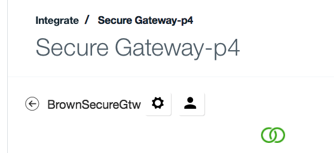
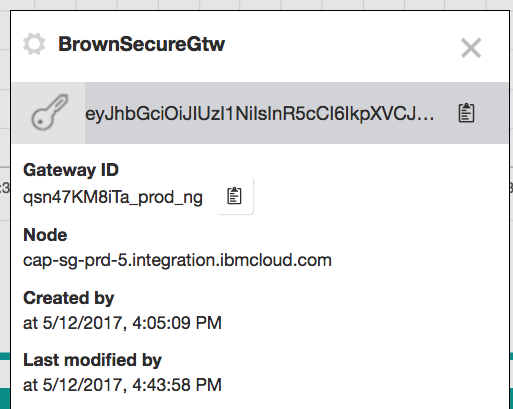
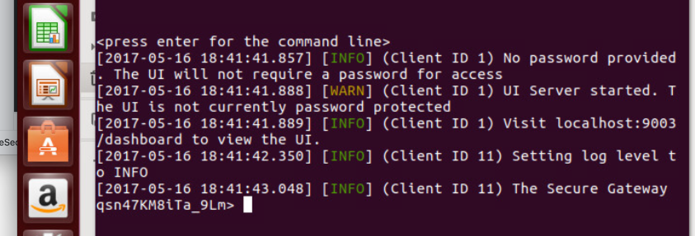
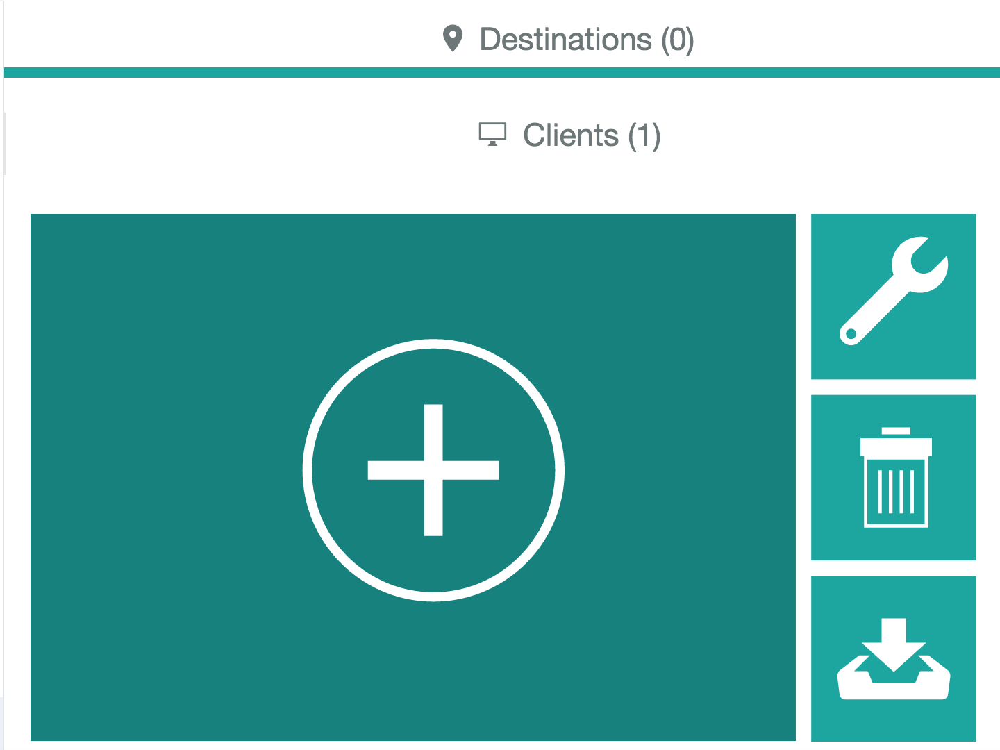
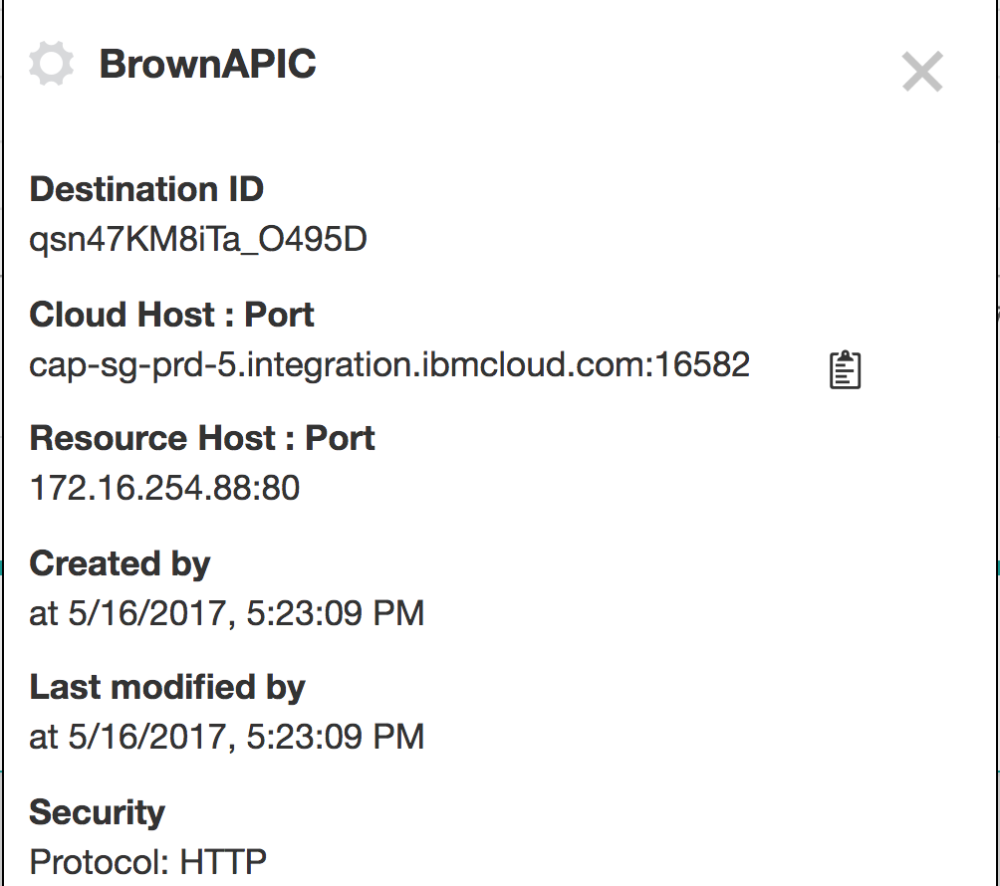

IBM Secure Gateway provides secure connectivity and establishes a tunnel between your Bluemix organization and the remote location that you want to connect to.

## Steps to perform
* In your Bluemix account / organization create a secure Gateway service using the path Catalog> Integrate > Secure Gateway
* Add gateway instance, using security token and token expiration. In the Bluemix Secure Gateway service and Manage menu access the Dashboard user interface, and then the settings menu (via the gear icon):

to access the server details:

It is important to keep the security token key string and the Gateway ID as they are needed for the client settings.
* On the on-premise server install one of the client on a Linux Ubuntu server. For convenience we picked up the Docker image by performing the following steps.

```
# download the docker image
$ sudo docker pull ibmcom/secure-gateway-client
# then start the client using the command
$ sudo docker run -P -it ibmcom/secure-gateway-client
# to see the client process running                                  
$ ps -ef
```  
* Back to the dashboard the client should be visible in the list of connected client. The client id should match the id returned by the docker run as illustrated below (the string with _9Lm)


The client makes a connection to the service instance running in bluemix and then open a bi-directional tunnel so data can be sent from a Bluemix app to the on-premise server. In the case of this integration the server will be a API Connect gateway.

When the client is set up and running, we need to add destination for the on-premise application end-point. You need to gather a set of information for your end points:
* The IP address or host name
* The type of protocol to support, most likely HTTS
* any user authentication credentials used to access the service.

Use the add destination from the Dashboard, and follow the step by step wizards


Once done the new destination is added, and using the gear icon it is possible to access the detail of the destination. One important elements is the cloud host name that is needed for the bluemix app to call the on-premise app.

## Integrate the on-premise end point into your application
The example below is a simple nodejs script to do a HTTP request to the bluemix proxy
## References
* [Bluemix Secure Gateway Service Documentation](https://console.ng.bluemix.net/docs/services/SecureGateway/secure_gateway.html)
* [Reaching Enterprise Backend with Bluemix Secure Gateway via SDK API](https://www.ibm.com/blogs/bluemix/2015/04/reaching-enterprise-backend-bluemix-secure-gateway-via-sdk-api/)
