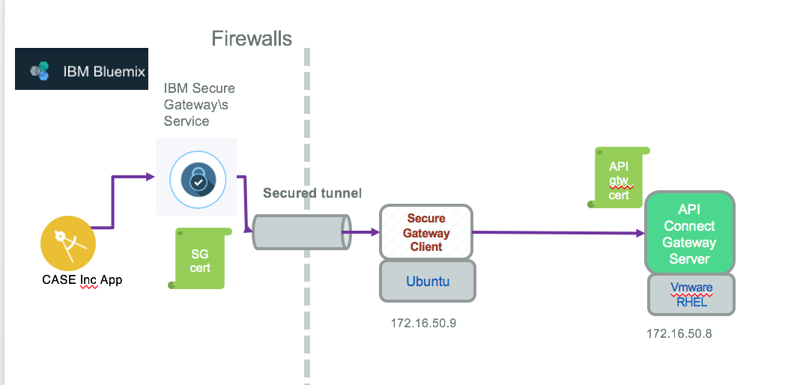

# Configure TLS end to end between Bluemix app and back end service


## Quick TLS summary

TLS and SSL uses public key/private key cryptography to encrypt data communication between the server and client, to allow the server to prove its identity to the client, and the client to prove its identity to the server.

Three fundamental components are involved in setting up an SSL connection between a server and client: a certificate, a public key, and a private key. Certificates are used to identify an identity: (CN, owner, location, state,... using the X509 distinguished name).

Entity can be a person or a computer. As part of the identity, the CN or Common Name attribute is the name used to identify the domain name of the server host.

To establish a secure connection to API Connect server, a client first resolves the domain name as specified in CN. After the SSL connection has been initiated, one of the first things the server will do is send its digital certificate. The client will perform a number of validation steps before determining if it will continue with the connection. Most importantly, the client will compare the domain name of the server it intended to connect to (in this case, 172.16.50.8) with the common name (the “CN” field) found in the subject’s identity on the certificate. If these names do not match, it means the client does not trust the identity of the server. This is the hand shake step.

Public keys and private keys are number pairs with a special relationship. Any data encrypted with one key can be decrypted with the other. This is known as asymmetric encryption. The server’s public key is embedded within its certificate. The public key is freely distributed so anyone wishing to establish an encrypted channel with the server may encrypt their data using the server’s public key. Data encrypted with a private key may be decrypted with the corresponding public key. This property of keys is used to ensure the integrity of a digital certificate in a process called digital signing.

In term of server / certificate we need to prepare the following schema may help to understand the dependencies:

API Gateway has its own public certificate, and the Secure Gateway has also one.

We need to do multiple things to get the connection end to end to be over TLS socket:
* Get SSL Certificate for the API Connect Gateway end point from a Certificate Agency given domain name, with assured identity. The IBM self certified certificate should not work when the client will do a hostname validation. For *Brown Compute* we are still using the self certified certificate and we will highlight the impact on the client code.
* Define TLS profile configuration for API Connect using the Cloud Management console
* Get certificate for each of the components in the path

Let go over those steps in details:

## pre-requisites
You need to have [openssl](https://www.openssl.org/) installed on your computer. For MAC users it is already installed. If you need to install see instruction [here](https://www.openssl.org/source/)

## 1. Get Secure Gateway certificate

The following command returns a lot of helpful information from a server like the IBM Secure Gateway we [configured](https://github.com/ibm-cloud-architecture/refarch-integration-utilities/blob/master/docs/ConfigureSecureGateway.md) on Bluemix.
`openssl s_client -connect cap-sg-prd-5.integration.ibmcloud.com:16582`

In the returned output, we can see the certificate chain presented by the server with the subject and issuer information:
```
Certificate chain
 0 s:/C=US/ST=NC/L=Durham/O=IBM Corporation/OU=SWG/CN=*.integration.ibmcloud.com
   i:/C=US/O=DigiCert Inc/CN=DigiCert SHA2 Secure Server CA
 1 s:/C=US/O=DigiCert Inc/CN=DigiCert SHA2 Secure Server CA
   i:/C=US/O=DigiCert Inc/OU=www.digicert.com/CN=DigiCert Global Root CA
```
one important output is the protocol and cipher suite used:
```
SSL-Session:
    Protocol  : TLSv1
    Cipher    : AES256-SHA
```
If we need to keep the server's PEM-encoded certificate save the ---BEGIN CERTIFICATE  to END CERTIFICATE to a file: sg.pem for this example. The following command will do it for you:
`echo | openssl s_client -connect cap-sg-prd-5.integration.ibmcloud.com:16582 -showcerts 2>&1 | sed  -n '/BEGIN CERTIFICATE/,/-END CERTIFICATE-/p'> sg.pem `

By default, s_client will print only the leaf certificate; as we want to print the entire chain, we use -showcerts switch.

Use this certificate for the client code in Bluemix.

## 2. Get the APIC server certificate
When connected via VPN to yor on-premise environment, you can get the TLS certificate for the API Connect Gateway server via the command:
`echo | openssl s_client -connect 172.16.50.8:443 -showcerts 2>&1 | sed  -n '/BEGIN CERTIFICATE/,/-END CERTIFICATE-/p'> apicgw.pem `

## Using Self certified SSL certificate

Generating client side key.


# References
* Open SSL [web site](http://www.openssl.org)
* [SSL Cookbook](https://www.feistyduck.com/library/openssl-cookbook/online/ch-testing-with-openssl.html)
