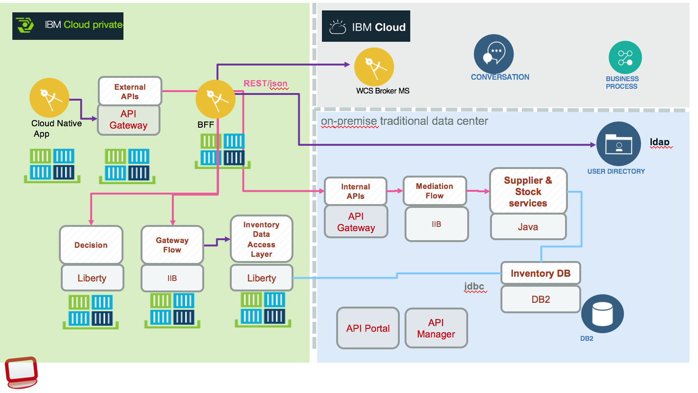

# Build, Deploy and Run
To address the hybrid integration patterns, we are proposing two deployment configurations combining public cloud, private cloud and on-premise traditional servers:
1. **Configuration 1**: the Portal Web Application, BFF micro service and API Management run on public cloud and the other legacy components on-premise servers:

  

  On left side is the cloud public deployment, on the right side, the bear metal or VM servers. The Web Application is deployed using container and IBM Cloud container service. (See [this note](./run-bmx-cs.md) for explanations). Using docker image helps us to move workload to Kubernetes cluster running on-premise as presented in the second configuration. The communication between the two environments is done using IBM [Secure Gateway service](https://github.com/ibm-cloud-architecture/refarch-integration-utilities/blob/master/docs/ConfigureSecureGateway.md) or can be done using private VPN.

1. **Configuration 2**:  covers the deployment of most of the solution components on to IBM Cloud Private, the IBM extension to Kubernetes. The BFF micro service is calling IBM cloud cognitive services running on IBM Cloud and on-premise backend services:

 

The light blue area represents on-premise servers, while the green area represents the IBM Cloud Private, kubernetes cluster. See detail in [Deployment to IBM Cloud Private article](./icp/README.md)

## Prerequisites
* You need your own [github.com](http://github.com) account
* You need a git client code. For example for [Windows](https://git-scm.com/download/win) and for [Mac](https://git-scm.com/download/mac)
* Install [npm](https://www.npmjs.com/get-npm) and [nodejs](https://nodejs.org). Normally getting `nodejs` last stable version will bring `npm` too.
* You need to have some knowledge on using virtual machine images and tool like vSphere.
* As we are migrating most of the workload to IBM Cloud Private, we delivered, for each component, dockerfiles and helm charts to deploy on Kubernetes.

## Get application source code
Clone this base repository using git client:
```
git clone https://github.com/ibm-cloud-architecture/refarch-integration.git
```

Then under the refarch-integration folder use the command ` ./clonePeers.sh` to clone the peer repositories of the 'hybrid integration' solution.

### Working on your own
The script ` ./fork-repos.sh` should help you to fork all the repositories of this solution within your github account.

## Continuous integration and deployment
We are detailing how to install a 'jenkins' server on ICP and delivering jenkins file and scripts for each project to do CI/CD. See [this note](./devops/README.md) for installation detail.

## Specifics deployment
Each project covers in detail how to build and run their own components.
* For the Case Inc Portal app [see the deployment note.](https://github.com/ibm-cloud-architecture/refarch-caseinc-app/blob/master/docs/icp/README.md)
* For [API Connect](https://github.com/ibm-cloud-architecture/refarch-integration-api), installed on-premise, is used as API gateway to the different API run times.
* The [IBM Integration Bus deployment](https://github.com/ibm-cloud-architecture/refarch-integration-esb#deployment), is used to do interfaces mapping between the SOAP data access layer, implemented in Java, and the RESTful API exposed to the public applications, and other mediation or orchestration flow. For detail see [this note](./iib.md)
* The **Data Access Layer** is a JAXWS application running on WebSphere Liberty server and exposing a set of SOAP services. The server is *BrownLibertyAppServer*. See [this repository](https://github.com/ibm-cloud-architecture/refarch-integration-inventory-dal/#build-and-deploy) for detail.
* The inventory **database** is running on DB2 and is not directly accessed from API connect, but applying SOA principles, it is accessed via a Data Access Layer app. The server is *BrownDB2*.

To run the backend solution, we will deliver VM images for you to install on your servers... stay tuned, from now we are describing how each server is configured in each of the specific github repository. We are using VmWare vSphere product to manage all the virtual machines. The figure below presents the *Brown* Resource Pool with the current servers:   


## Configuration 1 Physical Deployment
The Configuration 1 Physical deployment includes six servers, and each installation description is done in each git hub repository so you can replicate the configuration if you want to. It should take you one hour per server.
* DB2 server read [this note](https://github.com/ibm-cloud-architecture/refarch-integration-inventory-db2#db2-server-installation)
* Liberty App server read [this article](https://github.com/ibm-cloud-architecture/refarch-integration-inventory-dal/blob/master/docs/liberty-server.md)
* IBM Integration Bus see [this article](https://github.com/ibm-cloud-architecture/refarch-integration-esb#virtual-machine-deployment).
* API Connect see [Server config](https://github.com/ibm-cloud-architecture/refarch-integration-api#server-configuration)
* Open LDAP Server running on the utility server [LDAP Configuration](https://github.com/ibm-cloud-architecture/refarch-integration-utilities#ldap-configuration)
* [Utility Server](https://github.com/ibm-cloud-architecture/refarch-integration-utilities#server-configuration) runs IBM Secure Gateway and [Jenkins server](https://github.com/ibm-cloud-architecture/refarch-integration-utilities/blob/master/docs/cicd.md#installation)  

As an alternate and easier approach we are delivering a Vagrant file to combine Liberty, DB2 servers in one image: the explanation on how to use it [is here](../vm/README.md)

## Run on premise servers
There are multiple steps to make the solution working. Be sure to start each sever in the following order:
* Start DB2 server
* Start App server
* Start IIB
* Start API Connect servers: Gateway, Management and Portal
* Start Utility server
* Start 'case inc' portal APP

The [testing project](https://github.com/ibm-cloud-architecture/refarch-integration-tests) implements a set of test cases to validate each of the component of this n-tier architecture. It is possible to validate each component work independently.

The demonstration script instructions are [here](https://github.com/ibm-cloud-architecture/refarch-caseinc-app/blob/master/docs/demoflow.md)

For demonstration purpose not all back end servers are set in high availability.

## Run on IBM Cloud Private
Most of the components of this solution can run on IBM Cloud Private we are detailing it [here](icp/README.md)

## Run on IBM Cloud Container Service
See this detail note [here](run-bmx-cs.md) to deploy and run the Web App as container inside the [IBM Cloud Container Service](https://console.bluemix.net/docs/containers/container_index.html).

## Run on IBM Cloud Cloud Foundry
See this detail note [here](run-bmx-cf.md) to deploy the Web App as cloud foundry app on IBM Cloud
