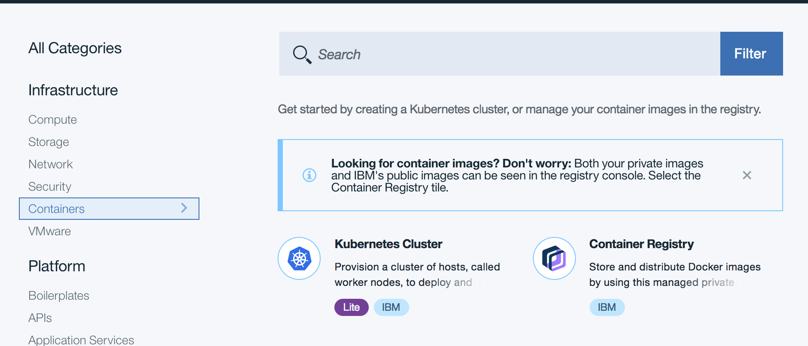
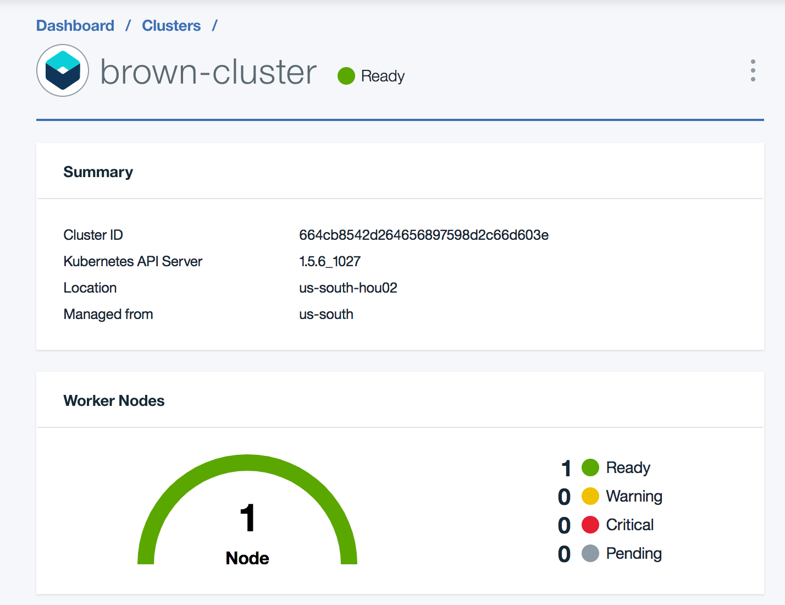

# Run on IBM Cloud Container Service
The kubernetes cluster is optional as the Case Inc Portal app can run in a docker container or as a cloud foundry application. We still encourage to use Kubernetes to deploy microservice as it offers a lot of added values we need.

You may have the CLI for bluemix container installed via the script: `./install_cli.sh`

### Step1: Provision Kubernetes Cluster on IBM IBM Cloud
In the IBM Cloud Catalog go to **Containers** on the left navigation panel and select ** Kubernetes Cluster**:



Select the **Lite** configuration for your development environment. For production use the **Standard** configuration.

  

Once created, it can take sometime to get all the related infrastructure provisioned, you should be able to see the dashboard. One Worker node is running.



So if you want to deploy to Kubernetes you need to do the following instructions:
```
$ bx login
$ bx cs init --host https://us-south.containers.bluemix.net
```

The following table summarized the command you may need
| Command | Description | Comment|
|---|---|---|
| bx cs clusters | list the clusters from your org | return the name, ID, state... |
| | Command to set the context of your interaction with the cluster |
|---|---|---|

The web application is dockerized and detail on the deployment is done in the related [repository](https://github.com/ibm-cloud-architecture/refarch-caseinc-app#deploy-the-caseinc-portal-app-in-bluemix-kubernetes-service).
