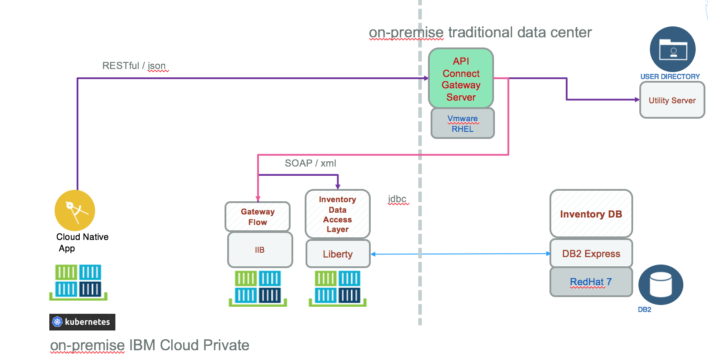

# IBM Cloud Private Deployment
In this section we are presenting how *Brown compute* is deployed to ICp.

The following diagram  presents the target deployment approach. The Web app is packaged as docker container and deploy to IPc kubernetes cluster, as well as the JAXWS app running on Liberty, and the Gateway flow running on IBM Integration Bus.
