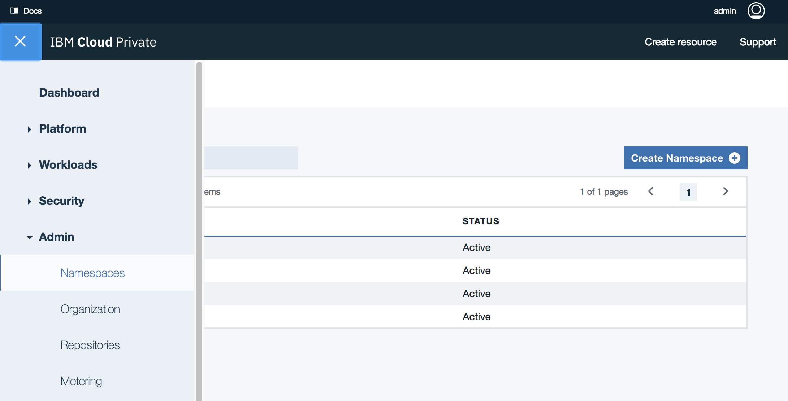

# IBM Cloud Private Deployment
In this section we are presenting how *Hybrid integration compute implementation* is deployed to IBM Cloud Private. For that we will address different configurations as business and operation requirements may differ per data center.

Updated 10/18/2107

## Prerequisites
* A conceptual understanding of how [Kubernetes](https://kubernetes.io/docs/concepts/) works.
* A high-level understanding of [Helm and Kubernetes package management](https://docs.helm.sh/architecture/).
* A basic understanding of [IBM Cloud Private cluster architecture](https://www.ibm.com/support/knowledgecenter/SSBS6K_2.1.0/getting_started/architecture.html).
* Access to an operational IBM Cloud Private cluster.
* Install the IBM Cloud Private command line interface to manage applications, containers, services...
* Add a **brown** namespace using ICP admin console, under Admin > Namespaces menu



We will use this namespace to push brown components.


# Configurations
## Cfg 1: Cloud native application on ICP
This is the simplest deployment where the cloud native web application ([the 'case' portal](https://github.com/ibm-cloud-architecture/refarch-caseinc-app)) is deployed as container running in ICP, but it accesses the back end service via API Connect running on-premise. All other components run on-premise.


This approach will be the less disruptive, let the development team to innovate with new polyglot runtime environments supported by Cloud native based application.

To support this configuration you just need to package the web application as docker container, define a helm chart for ICP deployment configuration settings, and use helm and kubectl command line interface. The [following tutorial](https://github.com/ibm-cloud-architecture/refarch-caseinc-app/blob/master/docs/run-icp.md) presents those steps in detail.

## Cfg 2: Web App, API Connect on ICP
This configuration is not yet supported. The API Connect gateway component, the API manager and API developer portal are all deployed on ICP.


The gateway flow running the interface mapping runs on IBM Integration bus.

This configuration should be quite common as the Integration Bus is using existing high end deployment, scale both horizontally and vertically, and most likely will not move to ICP.

When API Connect will support full container deployment this configuration will be valid and documented here.

## Cfg 3: Web App, API Connect and Liberty App on ICP

For this configuration the web service application running on WebSphere Liberty profile is moved to ICP, while IIB stays on premise, as well as the data base servers. Basically the approach is to keep heavy investment as-is as they are most likely supporting other data base and message flows for other applications. Still the light weight applications and runtime environment can move easily to ICP.


To support this configuration on top of config 2, the  *Inventory Data Access Layer* app running on Liberty is packaged as docker container and deployed using helm chart deployment configuration. Please read [this article](https://github.com/ibm-cloud-architecture/refarch-integration-inventory-dal/blob/master/docs/icp-deploy.md) to assess how it is done.

The LDAP, DB2 server servers are still running on Traditional IT servers.

## Cfg 4: Integration outside of ICP
This configuration is using integration components on premise and the other more lightweight components on ICP:
* Any Web applications
* Data access Layer
* Database


We document [here]() how to deploy DB2 on ICP.

This approach leverages existing investment and IIB concept of operation, and IBM Datapower for security and API gateway.


## Cfg 5: IIB to ICP
This configuration add IIB deployed on ICP to the previous configuration.


This approach has an impact on the way to manage application inside IIB. Instead of deploying multiple applications inside one instance of IIB, we are packaging the app and IIB runtime into a unique container to deploy in pods and facilitate horizontal scaling. The vertical scaling delivered out of the box in IIB is not leveraged.

The how to do this kind of deployment is described [here](https://github.com/ibm-cloud-architecture/refarch-integration-esb/blob/master/IBMCloudprivate/README.md)

The last configuration will be to run all the components on ICP, and we already documented how each component deploy.

## Build server
The build server will also stay on-premise as it is used by "multiple teams". This approach is to illustrate a real hybrid IT environment (We do not need to proof that all the pieces can run on cloud based solutions).


# ICP installation
For the development purpose, tutorial, etc, we are using a deployment in a single virtual machine, but you will have different installation for each of you different staging environments. For a full tutorial on how to install ICP with 5 hosts see [this note](https://github.com/ibm-cloud-architecture/refarch-privatecloud/blob/master/Installing_ICP_on_prem.md)

See [ICP 2.1 product documentation](https://www.ibm.com/support/knowledgecenter/SSBS6K_2.1.0/installing/install_containers_CE.html) to get other details.


## ICP instance for development
We have created a single VM to host ICP for development purpose (See detail [in VM Configuration for IBM Cloud Private 2.1](install-dev-icp21.md)).
There is a nice alternate solution to define your own VM, is to use a Vagrant file to get a ICP up and running quickly see [this github](https://github.com/IBM/deploy-ibm-cloud-private).

This section is a quick summary of what you may do to install a ICP 2.1 CE development host on a single VM with Ubuntu 64 bits 16.10.

The developer environment may look like the following diagram, for a developer on Mac and a VM ubuntu image (Windows will look similar)


The developer's machine and VM needs both to have docker or at least the VM needs it. To access the cluster environment you need *kubectl** command line interface and hosts configuration to match the configuration defined during the ICP install.

A developer needs to have on his development environment the following components:
* [Docker](#install-docker)
* [Kubectl](#install-kubectl)
* [Helm](#install-helm)
* A VM player to install and run ubuntu machine

If you need to access the dockerhub IBM public images, use [docker hub explorer](https://hub.docker.com/explore/) and search for **ibmcom**

# Common installation tasks
There are a set of tools and configuration you need to perform, to connect to ICP master node and interact with Kubernetes cluster, docker private registry and helm charts Tiller server.
As an example we are configuring the *build* server to be able to build the different docker images of our solution. The figure below illustrates what need to be done:


A Jenkins server implements different pipeline to pull the different project from github, executes each jenkins file to build the different elements: compiled code, docker image, helm package.

## Install docker
If you do not have docker install on your development machine, we will not describe it again ;-). See [docker download](https://docs.docker.com/engine/installation/).
You also need docker on your build server where you have Jenkins or other CI tool up and running, as build steps for each component include *docker build*.

## Install Kubectl
You need to have kubectl on your development computer, on build server and on the ICP development server.
* Install kubectl from ibm image.

```
docker run -e LICENSE=accept --net=host -v /usr/local/bin:/data ibmcom/kubernetes:v1.7.3 cp /kubectl /data
```
the --net=host means to use the host network stack and not the one coming from the container.  -v is for mounting volume: the local /usr/local/bin is mounted to the /data in the container, so the command to cp /kubectl directory inside the container, to /data inside the container will in fact modify the host /usr/local/bin with kubectl CLI. (complex for a simple tar -xvf... but this is our new life...)

see [Docker volume notes](https://docs.docker.com/engine/admin/volumes/volumes/)

* Access the ICP kubernetes cluster information from the ICP Console.
From the Client configuration menu under your userid on the top right of the main console panel:


Copy and paste in a script or in a terminal windows to execute those commands. So now a command like:
```
kubectl cluster-info
```  
returns the cluster information within ICP.

## Install helm
You can install helm from the helm web site or using Helm packaged with ICP:
```
 docker run -t --entrypoint=/bin/cp -v /usr/local/bin:/data ibmcom/helm:v2.5.0  /helm /data/
```
Command very similar to the one to install kubectl. *--endpoint=* specifies the command to execute when the container starts. Same as *CMD*

Init the client side for helm
```
helm init --client-only
```

If you get the kubectl connected to ICP cluster (as presented in previous figure), then the following command should give you the version of the **Tiller** server running in ICP.
```
$ helm version
```
If you have configured kubeclt to connect to the ICP master server, the above command should return a client and server version.
```
Client: &version.Version{SemVer:"v2.5.0", GitCommit:"012cb0ac1a1b2f888144ef5a67b8dab6c2d45be6", GitTreeState:"clean"}
Server: &version.Version{SemVer:"v2.5.0", GitCommit:"012cb0ac1a1b2f888144ef5a67b8dab6c2d45be6", GitTreeState:"clean"}
```


# Docker repository
You have two choices: using the private image repository deployed in ICP or create one private docker image repository somewhere and declare it inside ICP.

## Access to ICP private repository
You need the public ssh keys of the master-node:
* connect to the VM where the master node runs, get the ip address, and the ca.crt with commands like below:
```
# on client machine
$ cd /etc/docker
# create a directory that marches the name of the cluster as defined in the config.yaml of ICP. 8500 is the port number.
$ mkdir certs.d/master.cfc:8500
$ cd certs.d/master.cfc:8500
$ scp root@masternodevmipaddress:/etc/docker/certs.d/master.cfc:8500/ca.crts .
```

So you copied the public key. An administrator could have sent it to you too.

* Add an entry for master.cfc in your /etc/hosts
```
172.16.5.xxx master.cfc
```

On your computer you need to restart *systemd* and *docker*
```
systemctl daemon-reload
service ssh restart
service docker restart
```

* Normally you should be able to login to remote docker with a userid know to the master node VM: admin is the default user.
```
docker login master.cfc:8500
User: admin
Password:
```

* Once done the deployment process is the same for each Application
   * build the docker image
   * tag the image with information about the target repository server, namespace, tag and version
   * push the image to the remote repository
   * build the helm package from the chart definition
   * install the chart to cluster using *helm*

## Define a remote helm repository
   ICP supports referencing remote helm charts repository, but it also includes internal repository as illustrated in following figure:
   

   The hybrid integration set of projects has each component creating its own helm packaging (tgz files) and persisted into the current project *charts* folder. An **index.yaml** file defines the components part of this repository.

## Troubleshooting
* Unknown authority
When doing a docker login the following message may be reported
```
Error response from daemon: Get https://mycluster.icp:8500/v2/: x509: certificate signed by unknown authority
```
Go to your docker engine configuration and add the remote registry as an insecure one. On MAC you select the docker > preferences > Advanced meny and then add the remote master name
```json
{
  "debug" : true,
  "experimental" : true,
  "insecure-registries" : [
    "jbcluster.icp:8500",
    "mycluster.icp:8500"
  ]
}
```
