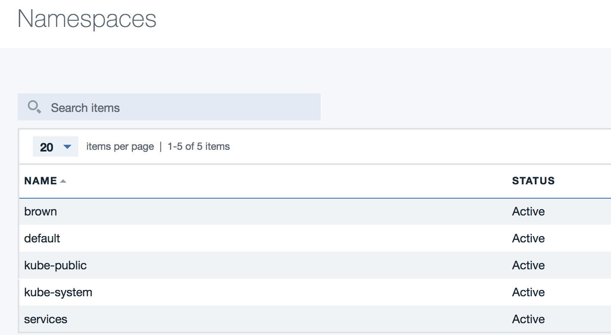
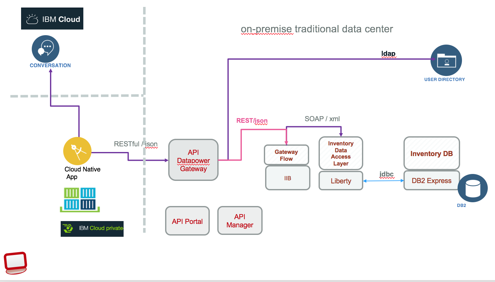
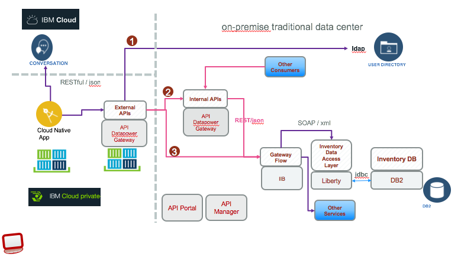
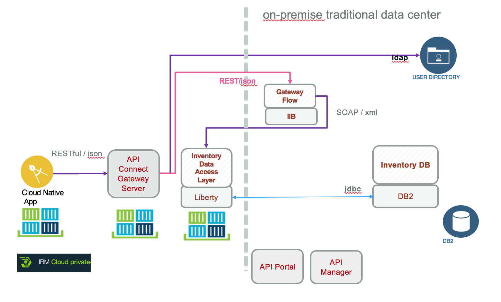
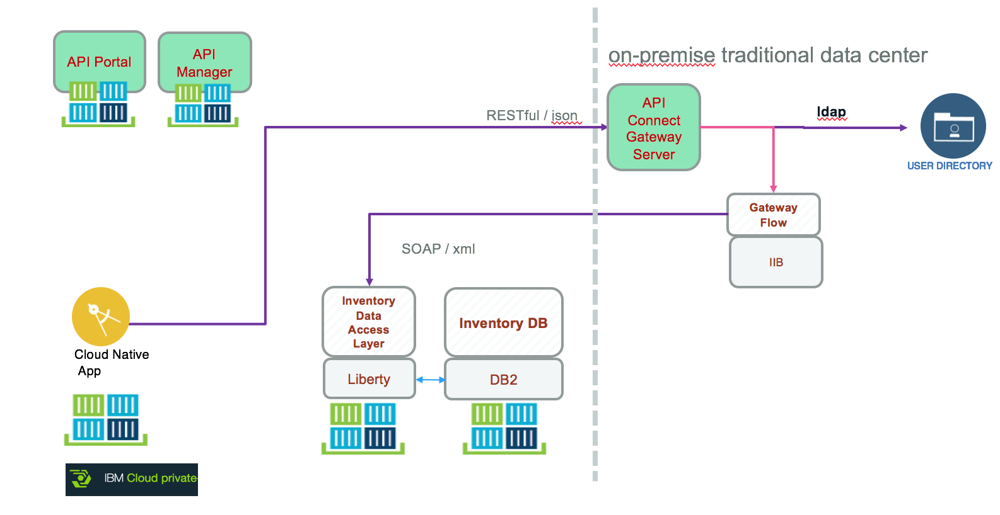
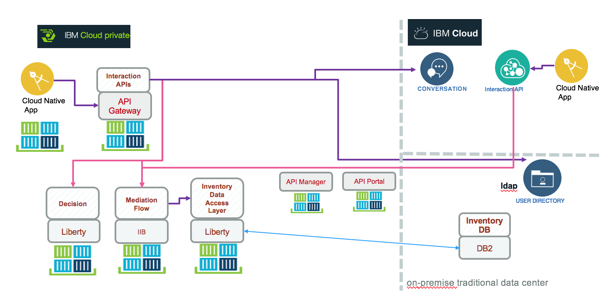
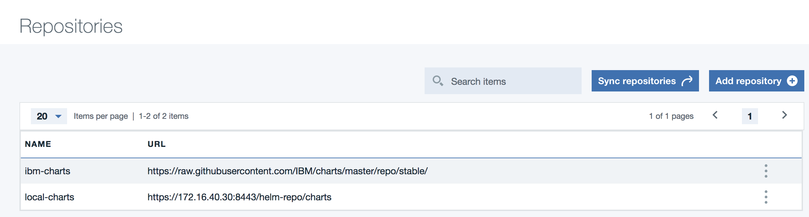

# IBM Cloud Private Deployment
In this section we are presenting how *Hybrid integration solution implementation* is deployed to IBM Cloud Private. We address different configurations as business and operation requirements may differ per data center and even per business applications. Each configuration describe how some of the components of the solution may be deployed to ICP or kept on-premise servers.

Updated 04/27/2018

## Table of Contents
* [Prerequisites](#prerequisites)
* [Community Edition installation (for your own development environment)](./dev-env-install.md)
* [Enterprise Edition Installation](https://github.com/ibm-cloud-architecture/refarch-privatecloud/blob/master/Installing_ICp_on_prem.md)
* [Deploy the 'browncompute' solution](#deployment-steps)
* [Hybrid integration deployment configurations:](#configurations) We are proposing different configurations for the hybrid solution deployment: Webapp, API gateway, message flow, SOAP services, data base.
* [Troubleshooting](troubleshooting.md)
* [Compendium](compendium.md) Get an exhaustive view of the things you need to read.

## Prerequisites
The following points should be considered before going into more detail of the ICP deployment:
* A conceptual understanding of how [Kubernetes](https://kubernetes.io/docs/concepts/) works.
* A high-level understanding of [Helm and Kubernetes package management](https://docs.helm.sh/architecture/).
* A basic understanding of [IBM Cloud Private cluster architecture](https://www.ibm.com/support/knowledgecenter/SSBS6K_2.1.0/getting_started/architecture.html).
* Understand the different [ICP environment and sizing](https://github.com/ibm-cloud-architecture/refarch-privatecloud/blob/master/Sizing.md)
* Access to an operational IBM Cloud Private cluster [see installation note](./dev-env-install.md) for the different approaches you could use.

A developer needs to have on his development environment the following components:
* [Docker](dev-env-install.md#install-docker)
* [Kubectl](dev-env-install.md#install-kubectl)
* [Helm](dev-env-install.md#install-helm)
we have provided a shell script to do those installation. Execute `./install_cli.sh` ( or `./install_cli.bat` for Windows)
* Add a **browncompute** namespace using ICP admin console, under **Admin > Namespaces** menu.



We will use this namespace to push the *hybrid integration* components into ICP cluster.

## Deployment steps
Here are the common steps to deploy each component of the brown compute solution.
* Create ICP Cluster if you do not have one
* [Setup Helm](#setup-helm)
* [Install Helm Chart](#install-helm-chart)
  + [Option 1: Clone the Repo & Install the Chart](#option-1-clone-the-repo--install-the-chart)
  + [Option 2: Install from Helm Chart Repository](#option-2-install-from-helm-chart-repository)
  + [Option 3: Install from Helm Chart Repository using ICP Helm Charts Catalog](#option-3-install-from-helm-chart-repository-using-icp-helm-charts-catalog)
* [Validate Helm Chart](#validate-helm-chart)
* Add Helm Repo
* Install Helm Chart
* Validate Helm Chart Installation
* Delete the Helm Chart
* Setup a CICD Pipeline for each project

### Setup helm
IBM Cloud Private contains integration with Helm that allows you to install the application and all of its components in a few steps. This can be done as an administrator using the following steps:
1. Click on the user icon on the top right corner and then click on `Configure client`.
2. Copy the displayed `kubectl` configuration, paste it in your terminal, and press Enter on your keyboard.
3. Initialize `helm` in your cluster. Use these [instructions](https://www.ibm.com/support/knowledgecenter/SSBS6K_2.1.0.2/app_center/create_helm_cli.html) to install and initialize `helm`.

### Install Helm Chart
We created [Helm Charts](https://github.com/kubernetes/helm/blob/master/docs/charts.md) for each project. For example the  [`browncompute-inventory-dal`](chart/browncompute-inventory-dal) chart packages all of the kubernetes resources required to deploy the `browncompute-inventory-dal` app and expose it to a public endpoint.

For more in-depth details of the inner-workings of Helm Charts, please refer to the [Helm Chart Documentation](https://github.com/kubernetes/helm/blob/master/docs/charts.md) to learn more about charts.

You have 3 options to install the chart:
1. Clone the Repo and Install the Chart.
2. Install the chart from our [`Helm Chart Repository`](https://github.com/kubernetes/helm/blob/master/docs/chart_repository.md), which is served [here](docs/charts) directly from GitHub.
3. Install the chart from our [`Helm Chart Repository`](https://github.com/kubernetes/helm/blob/master/docs/chart_repository.md) using ICP's Charts Catalog.

### Option 1: Clone the Repo & Install the Chart
To clone the repo & install the [`browncompute-inventory-dal`](chart/browncompute-inventory-dal) chart from source, run the following commands:
```bash
# Clone the repo
$ git clone https://github.com/ibm-cloud-architecture/refarch-integration-inventory-dal.git

# Change to repo directory
$ cd refarch-integration-inventory-dal

# Install the Chart
$ helm install chart/browncompute-inventory-dal --name browncompute-dal --tls
```

### Option 2: Install from Helm Chart Repository
For this project, we created a [`Helm Chart Repository`](https://github.com/kubernetes/helm/blob/master/docs/chart_repository.md) (located [here](docs/charts)) where we serve a packaged version of the [`browncompute-inventory-dal`](chart/browncompute-inventory-dal) so that you can conveniently install it in your ICP Cluster.

To install the chart from the `Helm Chart Repository`, run the following commands:
```bash
# Add Local Reference to Helm Chart Repository
$ helm repo add browncompute https://raw.githubusercontent.com/ibm-cloud-architecture/refarch-integration-inventory-dal/master/docs/charts

# Install the Chart
$ helm install browncompute/browncompute-inventory-dal --name browncompute-dal --tls
```

### Option 3: Install from Helm Chart Repository using ICP Helm Charts Catalog
Coming Soon

## Validate Helm Chart
If you installed the chart successfuly, you should see a CLI output similar to the following:
```
NAME:   browncompute-dal
LAST DEPLOYED: Tue Nov 14 22:23:39 2017
NAMESPACE: browncompute
STATUS: DEPLOYED

RESOURCES:
==> v1/Service
NAME             CLUSTER-IP    EXTERNAL-IP  PORT(S)            AGE
inventorydalsvc  10.101.0.176  <none>       9080/TCP,9443/TCP  1s

==> v1beta1/Deployment
NAME                               DESIRED  CURRENT  UP-TO-DATE  AVAILABLE  AGE
browncompute-dal-browncompute-dal  2        2        2           0          1s

==> v1beta1/Ingress
NAME                               HOSTS           ADDRESS  PORTS  AGE
browncompute-dal-browncompute-dal  dal.brown.case            80       1s

```
# Configurations
As an hybrid solution each component of the solution may run on existing on-premise servers or within IBM Cloud Private cluster. The deployment decision will be driven by the business requirements and the availability of underlying IBM middleware product as docker image and helm chart.

For each component of the 'hybrid integration' solution the following needs may be done:
   * build the docker image
   * tag the image with information about the target repository server, namespace, tag and version
   * push the image to the remote docker repository (most likely the one inside ICP master node)
   * build the helm package from the chart definition
   * install the chart to ICP cluster using *helm install or upgrade* command line interface
   * access the URL end point

## Cfg 1: Cloud native application on ICP
This is the simplest deployment where only the cloud native web application ([the 'case' portal](https://github.com/ibm-cloud-architecture/refarch-caseinc-app)) is deployed. It still accesses the back end services via API Connect running on-premise. All other components run on-premise. The figure below illustrates this deployment:



The webapp was developed as Angular / nodejs app, using cloud foundry deployment model. The approach was to externalize the configuration outside of CF and package the application as docker container. This approach will be the less disruptive as developers can quickly innovate using cloud native development practices.

To support this configuration you need to:  
1. compile and package the web application as docker container
1. define a helm chart for ICP using yaml files
1. use `helm` and `kubectl` command line interfaces to install and control the chart deployment
1. test with integration tests as defined in [this project](https://github.com/ibm-cloud-architecture/refarch-integration-tests)

For the web app deployment follow [the step by step tutorial](https://github.com/ibm-cloud-architecture/refarch-caseinc-app/blob/master/docs/icp/README.md).

If you want to review each on-premise component, their descriptions are below:
* [API Connect - Inventory product](https://github.com/ibm-cloud-architecture/refarch-integration#inventory-management)
* [Gateway flow in integration broker](https://github.com/ibm-cloud-architecture/refarch-integration-esb#inventory-flow)
* [SOAP service for data access Layer](https://github.com/ibm-cloud-architecture/refarch-integration-inventory-dal#code-explanation)
* [Inventory database](https://github.com/ibm-cloud-architecture/refarch-integration-inventory-db2#inventory-database)

## Cfg 2: Web App, Datapower Gateway on ICP
The goal for this configuration is to deploy Data power gateway to IBM cloud private and deploy the interaction APIs on it. The API product definition is split into interaction APIs and system APIs.



The second Datapower gateway is used to present 'System' APIs. (see this redbook ["A practical Guide for IBM Hybrid Integration Platform"](http://www.redbooks.ibm.com/redbooks/pdfs/sg248351.pdf) for detail about this clear APIs separation)

The `gateway flow`, deployed on IIB, is doing the REST to SOAP interface mapping: this configuration illustrates deep adoption of the ESB pattern leveraging existing high end deployments, scaling both horizontally and vertically. In this model the concept of operation for mediation and integration logic development and deployment are kept.

The steps are:
1. Modify the webapp configuration to use a different URL for the gateway flow: The settings is done in the `values.yaml` in the chart folder of the [case portal app](https://github.com/ibm-cloud-architecture/refarch-caseinc-app)
1. Deploy webapp to ICP [following the tutorial as seen in configuration 1](https://github.com/ibm-cloud-architecture/refarch-caseinc-app/blob/master/docs/icp/README.md)
1. Deploy API Connect gateway from ICP Catalog using [this tutorial](https://github.com/ibm-cloud-architecture/refarch-integration-api/blob/master/docs/icp/README.md)
1. Deploy the api product to the new gateway.

## Cfg 3: Web App, Datapower Gateway and Liberty App on ICP

For this configuration the web service application running on WebSphere Liberty profile is moved to ICP, while IIB stays on premise, as well as the data base servers. Basically the approach is to keep heavy investment as-is as they are most likely supporting other data base instances and message flows used by other applications. Still the light weight applications can move easily to ICP. The interaction APIs is on ICP while the System APIs are running closer to the integration bus. This is more an API ownership control than a technology constraint.



To support this configuration on top of config 2, the  *Inventory Data Access Layer* app running on Liberty is packaged as docker container and deployed using helm chart deployment configuration.

The step by step instructions are in [the deploy DAL to ICP  tutorial](https://github.com/ibm-cloud-architecture/refarch-integration-inventory-dal/blob/master/docs/icp/README.md).

The LDAP, DB2 server servers are still running on Traditional IT servers.

## Cfg 4: Integration Bus as micro flow running in ICP
This configuration is using integration components on premise and the other more lightweight components on ICP, and add a micro-service for integration as introduced in [this article](https://developer.ibm.com/integration/blog/2017/04/16/12-factor-integration/) using a message flow deployed on IIB runninig in ICP.



We also have added Operation Decision Management product packaged as container and deployed on ICP following instructions: [ODM on Docker, Kubernetes, and IBM Cloud Private](https://developer.ibm.com/odm/2017/10/02/odm-docker-kubernetes-ibm-cloud-private/)

This approach leverages existing investment and IIB concept of operation, and IBM Datapower for security and API gateway. This approach has an impact on the way to manage application inside IIB. Instead of deploying multiple applications inside one instance of IIB, we are packaging the app and IIB runtime into a unique container to deploy in pods and facilitate horizontal scaling. The vertical scaling delivered out of the box in IIB is not leveraged.

1. Deploy webapp to ICP [follows this tutorial](https://github.com/ibm-cloud-architecture/refarch-caseinc-app/blob/master/docs/run-icp.md)
1. Deploy Java application running on Liberty [read this tutorial](https://github.com/ibm-cloud-architecture/refarch-integration-dal/blob/master/icp/README.md))
1. Deploy IBM Integration Bus [read this tutorial](https://github.com/ibm-cloud-architecture/refarch-integration-esb/blob/master/IBMCloudprivate/README.md))
1. Deploy API Connect gateway from ICP Catalog using [this tutorial](https://github.com/ibm-cloud-architecture/refarch-integration-api/blob/master/docs/icp/README.md)
1. Deploy the api product to the new gateway.


## Cfg 5: All API Connect to ICP
This configuration runs every components on ICP, leverage public cloud services, and on-premise directory services.




## Use ICP Catalog
A packaged application can be used as template for creating application. Using the ICP admin console you can get the list of repositories using the ** Admin > Repositories ** menu:



Once the helm chart is packaged, a zip file is created and the publishing steps look like the following:

* copy the tfgz file to an HTTP server. (172.16.0.5 is a HTTP server running in our data center). Be sure to have write access to it.
```
$ scp casewebportal-0.0.1.tgz admin@172.16.0.5/storage/local-charts
```
* Then you need to update your private catalog index.yaml file.  The index file describes how your applications is listed in the ICP Application Center:
```
$ curl get -k https://9.19.34.107:8443/helm-repo/charts/index.yaml
$ helm repo index --merge index.yaml --url http://9.19.34.117:/storage/CASE/refarch-privatecloud ./
$ scp index.yaml admin@9.19.34.107:8443/helm-repo/charts
```

Once the repository are synchronized your helm chart should be in the catalog:


## kube-dns
Kubelets resolve hostnames for pods through a Service named `kube-dns`. kube-dns runs as a pod in the kube-system namespace. Every Service that is created is automatically assigned a DNS name. By default, this hostname is `ServiceName.Namespace`. All Services that are in the same namespace may omit `Namespace` and just use `ServiceName`. Here is an example:

Assume a Service named `foo` in the namespace `bar`. A Pod running in namespace `bar` can look up this service by simply doing a DNS query for `foo`. A Pod running in namespace `baz` can look up this service by doing a DNS query for `foo.bar`.
