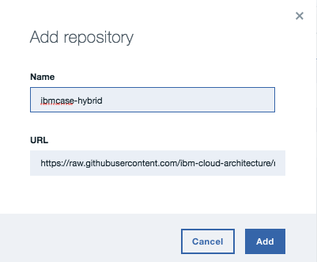

# Build your own helm repository for ICP
Github can be used to persisted the helm charts and then reference-able as source for the ICP catalog. We are presenting in this note how we did it.

## Cloud Native chart
The webapp in [the 'case' portal](https://github.com/ibm-cloud-architecture/refarch-caseinc-app) is packaged as helm [charts](https://github.com/kubernetes/charts). The commands used were:
```
$ helm init casewebportal
```
Then modified the values.yaml and template to reflect the expected outcomes, and all were described in [this note](https://github.com/ibm-cloud-architecture/refarch-caseinc-app/blob/master/docs/run-icp.md).  

The command build the chart named
```
$ helm package casewebportal
```
It should create a zip file with the content of the casewebportal folder. You will use the zip file if you want to get the package visible inside the Catalog. You can copy the .tgz file to a folder to be used as repository. In this solution we use the `charts` folder in this project.

## Build a chart repository
A chart repository is an HTTP server that houses an index.yaml file and optionally some packaged charts. A chart repository consists of packaged charts and a special file called index.yaml which contains an index of all of the charts in the repository.
So first you need a `index.yaml` file which declares the app you want to be visible in the ICP catalog and second reference the repository from your ICP install.

### index.yaml
The structure may look like this. It can be created once you have copy all the charts to the same folder using the commands
`helm index `
```yaml
apiVersion: v1
entries:
  casewebportal:
  - apiVersion: v1
    created: 2017-10-23T17:25:09.954656969-07:00
    description: Webapp used as portal to demonstrate hybrid integration
    digest: 2a8f11e4163c4c496280fc5441facf85648e0bcbee200345b7b8cae78d294ec2
    name: casewebportal
    home: https://github.com/ibm-cloud-architecture/refarch-caseinc-app
    keywords:
    - Hybrid
    - IBM
    - browncompute
    maintainers:
    - email: boyerje@us.ibm.com
      name: Jerome Boyer
    name: ibm-case-brown-web
    tillerVersion: '>=2.4.0'
    urls:
    - https://raw.githubusercontent.com/ibm-cloud-architecture/refarch-integration/charts/casewebportal-0.0.3.tgz
    version: 1.0.3
```

### Reference the repository
You can do that using the web interface of the ICP admin console: in the upper-left corner, click the menu and expand the **Admin** section. Click **Repositories** to specify a new Helm chart repository:  


and add the repository using the url to the docs/charts folder


As an alternate using the following command will have the same result
```
$ kubectl repo add ibmcase-hybrid https://raw.githubusercontent.com/ibm-cloud-architecture/refarch-integration/master/docs/charts
```
