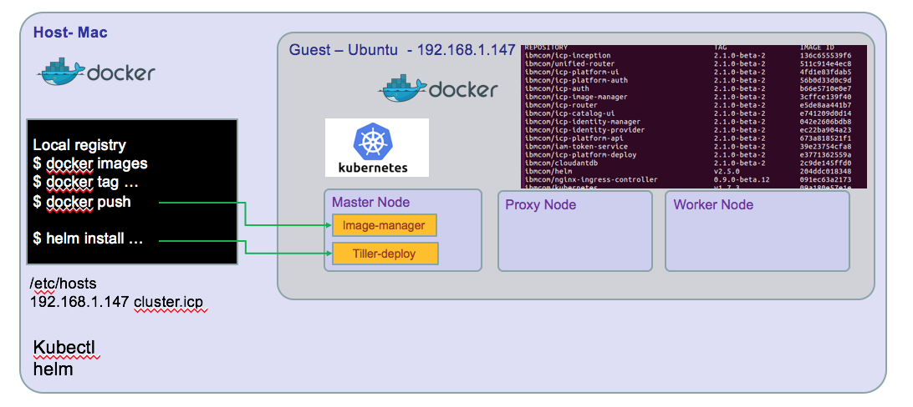
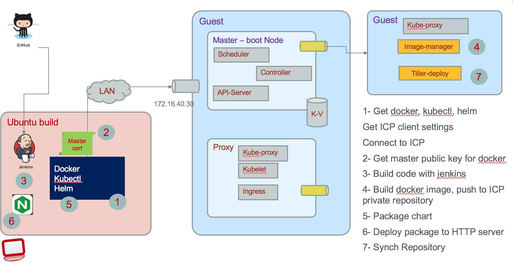

# Install a development environment with IBM Cloud Private 2.1
For staging purpose, we are using a ICP EE deployment in a five virtual machine cluster. In this note we are presenting a single virtual machine configuration based on Ubuntu 64 bits v16.10 and how to install ICP 2.1.0.2 on it.

Updated 04/23/2018

The developer environment may look like the following diagram, for a developer on Mac and a VM ubuntu image (Windows will look similar)


There is a nice alternate solution to get an ICP single VM up and running in fe minutes by using a Vagrant file: Clone [this github](https://github.com/IBM/deploy-ibm-cloud-private) and do a ```vagrant up```, 15 minutes later you have your environment with one proxy-master node and 3 worker nodes. Excellent!

If you need to access the dockerhub IBM public image, use [docker hub explorer](https://hub.docker.com/explore/)  and search for **ibmcom**

# Preparing your guest machine
## Install ubuntu
Follow your VM player instruction to create a virtual machine and access an ubuntu 16.10 .iso file

* The expected minimum resource are: CPUs: 2 Memory: 16GB Disk: 100GB (Thin Provisioned)
* Install ubuntu following the step by step wizard, create a user with admin privilege.
The ICP installation need root access and ssh connection to the different host nodes that are part of the topology. In the case of one VM you still need to do some security settings and make the system be passwordless with security key.

* Login as the newly create user
* Change root user password
```
$ sudo su -
$ passwd
```
* Update the ubuntu OS with last package references
```
apt-get update
```

* Install Linux image extra packages
```
apt-get install -y linux-image-extra-$(uname -r) linux-image-extra-virtual
```
* Install python
  ```
  $  apt-get install -y python-setuptools
  $ easy_install pip
  $ pip install docker-py
  ```
* Disable firewall if enabled
  ```
  $ ufw status
  $ sudo ufw disable
  ```

* Boot and log as root user

* Install NTP to keep time sync
```
apt-get install -y ntp
sytemctl restart ntp
# test it
ntpq -p
```

## Configure ssh for remote access
Install [openssh](https://www.openssh.com/), and authorize remote access
```
sudo apt-get install openssh-server
systemctl restart ssh
```

* Create ssh keys for your user and authorize ssh
```
# create rsa keys with no passphrase
$ ssh-keygen -b 4096 -t rsa -P ''
```
be sure the following parameters are enabled
```
$ vi  /etc/ssh/sshd_config
PermitRootLogin yes
PubkeyAuthentication yes
PasswordAuthentication yes
```
Then restart ssh daemon:
```
$ systemctl restart ssh
```
Copy the public key to the root user .ssh folder
```
$ ssh-copy-id -i .ssh/id_rsa root@ubuntu
```
Then you should be able to ssh root user to the guest machine.


## Install docker
The developer's machine and VM need both to have docker or at least the VM needs it. To access the cluster environment you need *kubectl** command line interface and hosts configuration to match the configuration defined during the ICP install.

If you do not have docker install on your development machine, we will not describe it again ;-). See [docker download](https://docs.docker.com/engine/installation/).

* Install docker on the ubuntu machine

* Install docker repository
  ```
   $ apt-get install -y apt-transport-https ca-certificates curl software-properties-common
  ```

* Get the GPG key
   ```
   $ curl -fsSL https://download.docker.com/linux/ubuntu/gpg | apt-key add - apt-key fingerprint 0EBFCD88
   ```
* Setup docker stable repository
  ```
  $ add-apt-repository "deb [arch=amd64] https://download.docker.com/linux/ubuntu $(lsb\_release -cs) stable”
  $ apt-get update
  $ apt-get install -y docker-ce
  ```

* Validate it runs
 ```
   docker run hello-world
 ```
* Add user to docker group
  ```
   # Verify docker group is defined
   $ cat /etc/group
   # add user
   $ usermod -G docker -a usermod
   # re-login the user to get the group assignment at the session level
   ```

When using a build server, you also need docker to be able to build the different docker images of our solution. The figure below illustrates what need to be done:


A Jenkins server implements different pipeline to pull the different project from github, executes each jenkins file to build the different elements: compiled code, docker image, helm charts, and then push images and helm charts to ICP.

## Install Kubectl
You need to have kubectl on your development computer and on any build server.
* Install kubectl from IBM image.
```
docker run -e LICENSE=accept --net=host -v /usr/local/bin:/data
ibmcom/kubernetes:v1.7.3 cp /kubectl /data
```
the --net=host means to use the host network stack and not the one coming from the container.  -v is for mounting volume: the local /usr/local/bin is mounted to the /data in the container, so the command to cp /kubectl directory inside the container, to /data inside the container will in fact modify the host /usr/local/bin with kubectl CLI. (complex for a simple tar -xvf... but this is our new life...)

see [Docker volume notes](https://docs.docker.com/engine/admin/volumes/volumes/)

Verify kubectl runs locally. We will get the cluster information to remote connect to it once ICP is installed.

## Install helm
IBM Cloud Private contains integration with Helm that allows you to install the application and all of its components in a few steps.

 This can be done as an administrator using the following steps:
1. Click on the user icon on the top right corner and then click on `Configure client`.
2. Copy the displayed `kubectl` configuration, paste it in your terminal, and press Enter on your keyboard.
3. Initialize `helm` in your cluster. Use these [instructions](https://www.ibm.com/support/knowledgecenter/SSBS6K_2.1.0.2/app_center/create_helm_cli.html) to install and initialize `helm`.

## Install IBM Cloud Private CE on the ubuntu machine
Verify the public docker hub images available: go to [docker hub explorer](https://hub.docker.com/explore/) and search for **ibmcom/icp-inception**

* Get the ICP  installer docker image using the following command
 ```
 $ sudo su -
 $ docker pull ibmcom/icp-inception:2.1.0
 > Digest: sha256:f6513...
Status: Downloaded newer image for ibmcom/icp-inception:2.1.0
 $
 $ mkdir /opt/ibm-cloud-private-ce-2.1.0
 $ cd /opt/ibm-cloud-private-ce-2.1.0
 ```
 The following command extracts configuration file under the *cluster* folder by mounting local folder to /data inside the container:
 ```
 $ docker run -e LICENSE=accept \
  -v "$(pwd)":/data ibmcom/icp-inception:2.1.0 cp -r cluster /data
 ```
* In the **cluster** folder there are multiple files to modify: config.yaml, hosts, and ssh-keys
  * hosts: As we run in a single VM, the master, proxy and worker node will have the same IP address. So get your VM's IP address using the command:
  ```
  $ ip address
  ```
   * Modify the hosts file
  ```
  [master]
   172.16.251.133
   [worker]
   172.16.251.133
   [proxy]
   172.16.251.133
  ```
  * Modify the **config.yaml** file using administrator privilege (so sudo) by specifying a domain name and cluster name.  Also set the loopback dns flag so the server will run in single VM without error.
  ```
  loopback_dns: true
  cluster_name: mycluster
  cluster_domain: mycluster.domain
  ```
  * Copy security keys you have created when configuring your linux environment to the ssh_key file
  ```
  $ cp ~/.ssh/id_rsa ./ssh_key
  ```
  * Deploy the environment now
  ```
  # from the cluster folder
  $ sudo docker run -e LICENSE=accept --net=host --rm -t -v "$(pwd)":/installer/cluster ibmcom/icp-inception:2.1.0 install
  ```
  * Verify access to ICP console using http://ipaddress:8443 admin/admin
  You should see the dashboard as in figure below:

  

# Image Repositories
To deploy application you need to package as docker image and push them within a docker repository, and then define kubernetes deployment configuration using Helm charts and install those charts to a helm Tiller server.

## Docker repository
You have two choices: using the private image repository deployed in ICP or create one private docker image repository somewhere and declare it inside ICP.

## Access to ICP private docker repository
You need the public ssh keys of the master-node:
* connect to the VM where the master node runs, get the ip address, and the ca.crt with commands like below:
```
# on client machine
$ cd /etc/docker
# create a directory that matches the name of the cluster as defined in the config.yaml of ICP. 8500 is the port number.
$ mkdir certs.d/myclyster.icp:8500
$ cd certs.d/myclyster.icp:8500
$ scp root@masternodevmipaddress:/etc/docker/certs.d/mycluster.icp:8500/ca.crts .
```

So you copied the public key. An administrator could have sent it to you too.

* Add an entry for mycluster.icp in your /etc/hosts
```
172.16.5.xxx master.cfc
```

On your computer you need to restart *systemd* and *docker*
```
systemctl daemon-reload
service ssh restart
service docker restart
```

* Normally you should be able to login to remote docker with a userid known to the master node VM: admin is the default user.
```
docker login mycluster.icp:8500
User: admin
Password:
```

## Define a remote helm repository
   ICP supports referencing remote helm charts repository, but it also includes internal repository as illustrated in following figure:
   

   The hybrid integration set of projects has each component creating its own helm packaging (tgz files) and persisted into the current project *charts* folder. An **index.yaml** file defines the components part of this repository.


## Connect kubectl to remote cluster-master
* Access the ICP kubernetes cluster information from the ICP Console.
From the Client configuration menu under your userid on the top right of the main console panel to access the configuration:


Copy and paste in a script or in a terminal to execute those commands. So now a command like:
```
kubectl cluster-info
```  
returns the cluster information within ICP.
```
Kubernetes master is running at https://192.168.27.100:8001
catalog-ui is running at https://192.168.27.100:8001/api/v1/proxy/namespaces/kube-system/services/catalog-ui
Heapster is running at https://192.168.27.100:8001/api/v1/proxy/namespaces/kube-system/services/heapster
image-manager is running at https://192.168.27.100:8001/api/v1/proxy/namespaces/kube-system/services/image-manager
KubeDNS is running at https://192.168.27.100:8001/api/v1/proxy/namespaces/kube-system/services/kube-dns
platform-ui is running at https://192.168.27.100:8001/api/v1/proxy/namespaces/kube-system/services/platform-ui

To further debug and diagnose cluster problems, use 'kubectl cluster-info dump'.
```


## Verify Helm is connected to Tiller server running on ICP
If you get the kubectl connected to ICP cluster (as presented in previous figure), then the following command should give you the version of the **Tiller** server running in ICP.
```
$ helm version
```
If you have configured kubeclt to connect to the ICP master server, the following command should give you the version of the **Tiller** server running in ICP.
```
Client: &version.Version{SemVer:"v2.5.0", GitCommit:"012cb0ac1a1b2f888144ef5a67b8dab6c2d45be6", GitTreeState:"clean"}
Server: &version.Version{SemVer:"v2.5.0", GitCommit:"012cb0ac1a1b2f888144ef5a67b8dab6c2d45be6", GitTreeState:"clean"}

```
