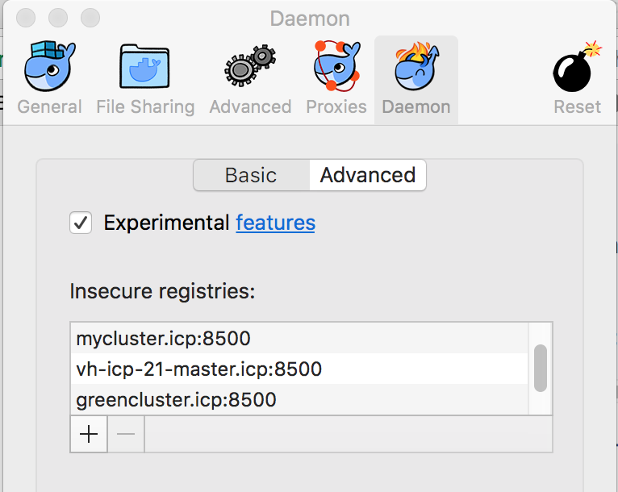
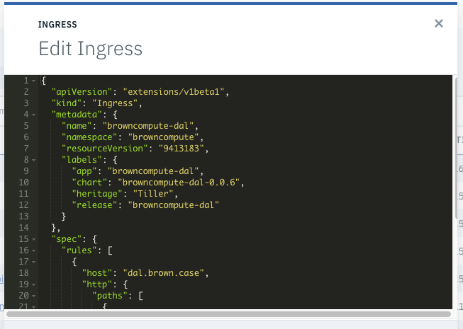

# Troubleshooting in ICP
This note regroups a set of things we have met during our work on kubernetes and ICP.

Update 5/03/2018 for ICP 2.1.0.2.

* The Kubernetes [official troubleshooting docs](https://kubernetes.io/docs/getting-started-guides/ubuntu/troubleshooting/)

# Table of contents
* [Installation specifics](#installation-specifics)
* [Access during development](#access)
* [Deployment](#deployment)
* [Investigation](#investigation)


# Installation specifics
The installation of the ICP 2.1.0.x is [here](https://www.ibm.com/support/knowledgecenter/SSBS6K_2.1.0.2/app_center/create_helm_cli.html)

## Error: hostname not resolved
  ```
   fatal: [...] => Failed to connect to the host via ssh: ssh: Could not resolve hostname ...:
   Name or service not known
  ```
  * verify the hostname match the ip address in /etc/hosts
  * be sure to start the installation from the folder with the hosts file. It should be cluster or modify $(pwd) to $(pwd)/cluster

## ssh connect failure
  ```
  fatal: [192.168.1.147] => Failed to connect to the host via ssh:
  Permission denied (publickey, password).
  ```
This is a problem of accessing root user during the installation. Be sure to authorize root login, (ssh_config file), that the ssh_key is in the root user home/.ssh. See [above](#ubuntu-specifics)


While login from a developer's laptop.
```
$ docker login cluster.icp:8500
>
Error response from daemon: Get https://cluster.icp:8500/v2/: net/http:
request canceled while waiting for connection (Client.Timeout exceeded while awaiting headers)
```
Be sure the cluster.icp hostname is mapped to the host's IP address in the local /etc/hosts

## Issues during upgrade to 2.1.0.1
The following issues are errors that may occur during the upgrade to ICP 2.1.0.1.

### Etcd Fails to Start During Upgrade
While running the Kubernetes upgrade on the master node, Etcd fails to start. This is due to swap being enabled on the OS. Resolution is to disable swap.

#### Error Message
  ```
  TASK [upgrade-master : Waiting for Etcd to start] ******************************
  fatal: [172.16.40.130]: FAILED! => {"changed": false, "elapsed": 600, "failed": true, "msg": "The Etcd component failed to start. For more details, see https://ibm.biz/etcd-fails."}
  ```

#### Problem Determination & Resolution
  1. Check Kubelet Logs to determine why node has not started.
  ```
  $ journalctl -u kubelet &> kl.log
  ```
  2. Open kl.log and check the error.
  ```
  Jan 18 11:42:32 green-icp-proxy hyperkube[31106]: Error: failed to run Kubelet: Running with swap on is not supported, please disable swap! or set --fail-swap-on flag to false. /proc/swaps contained: [Filename
  ```
  3. Disable swap.
  ```
  $ swapoff -a
  $ sudo sed -i '/ swap / s/^\(.*\)$/#\1/g' /etc/fstab
  ```

### Kubelet Install Fails on Nodes
During the Kubernetes upgrade step, the installer attempts to install Kubelet on each of the nodes. The installation fails because the ibmcom/kubernetes:v1.8.3-ee image is not on the nodes. Resolution is to put the image on the nodes manually.

#### Error Message
  ```
  TASK [upgrade-kubelet : Ensuring kubelet install dir exists] ****************************************************************************************************************************************
  ok: [172.16.40.135]
  FAILED - RETRYING: Copying hyperkube onto operating system (3 retries left).
  FAILED - RETRYING: Copying hyperkube onto operating system (2 retries left).
  FAILED - RETRYING: Copying hyperkube onto operating system (1 retries left).

  TASK [upgrade-kubelet : Copying hyperkube onto operating system] ************************************************************************************************************************************
  fatal: [172.16.40.135]: FAILED! => {"attempts": 3, "changed": true, "cmd": "docker run --rm -v /opt/kubernetes/:/data ibmcom/kubernetes:v1.8.3-ee sh -c 'cp -f /hyperkube /data/'", "delta": "0:00:00.574937", "end": "2018-01-18 10:03:52.881064", "failed": true, "rc": 125, "start": "2018-01-18 10:03:52.306127", "stderr": "Unable to find image 'ibmcom/kubernetes:v1.8.3-ee' locally\ndocker: Error response from daemon: manifest for ibmcom/kubernetes:v1.8.3-ee not found.\nSee 'docker run --help'.", "stderr_lines": ["Unable to find image 'ibmcom/kubernetes:v1.8.3-ee' locally", "docker: Error response from daemon: manifest for ibmcom/kubernetes:v1.8.3-ee not found.", "See 'docker run --help'."], "stdout": "", "stdout_lines": []}
  ```
#### Problem Determination & Resolution
  1. Log onto node and checked the local images. Notice that the ibmcom/kubernetes:v1.8.3-ee image is absent.
  ```
  $ docker image ls
  ```

  2. Copy ibm-cloud-private-x86_64-2.1.0.1.tar.gz package to the node.

  3. Extract the images and load into Docker
  ```
  $ tar xf ibm-cloud-private-x86_64-2.1.0.1.tar.gz -O | sudo docker load
  ```


# Access
See [official faq on login](https://www.ibm.com/support/knowledgecenter/SSBS6K_2.1.0.2/troubleshoot/cli_login.html)

## Unknown certificate authority
```
$ docker login mycluster.icp:8500
Error response from daemon: Get https://mycluster.icp:8500/v2/: x509: certificate signed by unknown authority
```

Go to your docker engine configuration and add the remote registry as an insecure one. On MAC you select the docker > preferences > Daemons> Advanced menu and then add the remote master name
```json
{
  "debug" : true,
  "experimental" : true,
  "insecure-registries" : [
    "jbcluster.icp:8500",
    "mycluster.icp:8500",
    "cpscluster.icp:8500"
  ]
}
```

You can also verify the certificates are in the logged user **~/.docker** folder. This folder should have a **certs.d** folder and one folder per remote server, you need to access. So the mycluster.icp:8500/ca.crt file needs to be copied there too.

## Not able to login to docker repository running on master node
Different type of messages:
### Unknown authority
`Error response from daemon: Get https://greencluster.icp:8500/v2/: x509: certificate signed by unknown authority.
You need to configure your local docker to accept to connect to insecure registries by adding an entry about the target host.
On MACOS the Preferences> Daemon > Advanced   




See also the note about accessing ICP private repository [here](https://github.com/ibm-cloud-architecture/refarch-cognitive/tree/master/docs/ICP#access-to-icp-private-docker-repository) and how to copy SSL certificate to your local host.

### x509 certificate not valid for a specific hostname
Be sure the hostname you are using is in your /etc/hosts and you `docker login` to the good host.

## Could not connect to a backend service. Try again later.   (E0004)
While trying to get cluster configuration with command like `bx pr cluster-config green2-cluster` got this message.

The problem may come from a lack of disk space on / on the host OS of the active master node. To add space for the virtual machine with Ubuntu OS, you need to do the following:
* Using the VM management tool like VMWare vsphere, add a new virtual disk
* log as root user to host OS, and list the device with `ls /dev/sd*`. You may have a new sdc or sdb device. We assume sdc for now.
* Stop docker and kubelet (it can take some time for docker to stop):   
 ```bash
systemctl stop docker
systemctl stop kubelet
```
* See existing disks with `fdisk -l` and add a new disk with `fdisk /dev/sdc`. It should add a DOS partition and use the w option to write the changes.
* Create different tables for the filesystem using `mkfs.ext4 /dev/sdc`
* mount the newly created filesystem to a new folder:
```
mkdir /mnt/disk
mount /dev/sdc /mnt/disk
```
* Move ICP install file to the new disk: `mv /opt/ibm/cfc/* /mnt/disk`
* unmount but update the boot setting to get the disk back on reboot:
 ```
 umount /mnt/disk
 vi /etc/fstab
  /dev/sdc /opt/ibm/cfc ext4 default 1 3
 ```
 * restart docker and kubelet:
 ```
 systemctl start docker
 systemctl start kubelet
 ```

See also [this note](https://kb.vmware.com/s/article/1003940)

## 503 on a deployed app with ingress rule
The following message "503 Service Temporarily Unavailable" may appear when accessing a pod via virtual hostname defined in Ingress rules. Be sure to understand the ingress role

To investigate do the following:
* Display the helm release, and verify the Ingress is specified and the hosts is specified, the IP address matches the proxy IP address in the cluster. In the service verify the type is ClusterIP and the ports map the exposed port in the docker image.  

* In the ingress verify the service name, the app selector are matching with the deployment parameters using Service > Ingress -> Edit:  


## Helm connection Issue: tls: bad certificate
For the  *Error: remote error: tls: bad certificate*:  you need to be logged into the cluster and get the cluster config. The commands are:
```
bx pr login -a https://ext-demo.icp:8443 -u admin --skip-ssl-validation
bx pr cluster-config mycluster
```

## Helm version not able to connect to Tiller.
Error: cannot connect to Tiller
With version 2.1.0.2, TLS is enforced to communicate with the server. So to get the version the command is `helm version --tls`. You need also to get the certificates for the cluster. The command ` bx pr cluster-config <custername>` will add those certificate into `~/.helm`.

## Helm incompatible version
The error message may look like: `Error: incompatible versions client[v2.9.1] server[v2.7.3+icp]`
Use the command to upgrade: `helm init --upgrade`

### For using SSL between Tiller and Helm
See [this note from github helm account](https://github.com/helm/helm/blob/master/docs/tiller_ssl.md)

# Deployment

## helm install command: User is not authorized to install release
Be sure to enter the good namespace name in the install command.

## Pod not getting the image from docker private repository
Looking at the Events report from the pod view you got a message like:
```
Failed to pull image “greencluster.icp:8500/greencompute/customerms:v0.0.7”: rpc error: code = Unknown desc = Error response from daemon: Get https://greencluster.icp:8500/v2/greencompute/customerms/manifests/v0.0.7: unauthorized: authentication required
```

The new version of k8s enforces the use of secret to access the docker private repository. So you need to add a secret, named for example regsecret, for the docker registry object.
```
$ kubectl create secret docker-registry regsecret --docker-server=172.16.40.130 --docker-username=admin --docker-password=<> --docker-email=<email> --namespace=greencompute
$ kubectl get secret regsecret --output=yaml --namespace=greencompute
```
Then modify the deployment.yaml to reference this secret so the pod can access the repo during deployment:
```  spec:
    containers:
      - name: {{ .Chart.Name }}
        image: "{{ .Values.image.repository }}:{{ .Values.image.tag }}"
        ....
    imagePullSecrets:
      - name: regsecret
```

## Verify deployment
When you deploy a helm chart you can assess how the deployment went using the ICP admin console or the kubectl CLI.

For the user interface, go to the ** Workloads > Deployments ** menu to access the list of current deployments. Select the deployment and then the pod list.
In the pod view select the events to assess how the pod deployment performed


and the log file in *Logs* menu


Using kublectl to get the status of a deployment
```
$ kubectl get deployments --namespace browncompute
> NAME                          DESIRED   CURRENT   UP-TO-DATE   AVAILABLE   AGE
casewebportal-casewebportal   1         1         1            1           2d

```
or a specific detail view:
```
kubectl describe deployment browncompute-dal-browncompute-dal
```

Get the logs and events
```
$  export POD_NAME=$(kubectl get pods --namespace browncompute -l "app=casewebportal-casewebportal" -o jsonpath="{.items[0].metadata.name}")

$ kubectl logs $POD_NAME --namespace browncompute

$  kubectl get events --namespace browncompute  --sort-by='.metadata.creationTimestamp'
```

## Error while getting cluster info
Try to do `kubectl cluster-info`: failed: error: you must be logged in to the server (the server has asked for the client to provide credentials):
* Be sure to have use the settings from the 'configure client'.
* Be sure the cluster name / IP address are mapped in /etc/hosts
* Be sure to have a ca.crt into `~/.ssh` folder
* Use the `bx pr login -a https://<ipaddress>:8443 -u admin` command to login to the cluster


### Default backend - 404
This error can occur if the ingress rules are not working well.

1. Assess if ingress is well defined: virtual hostname, proxy address and status/age of running
  ```
  kubectl get ing --namespace browncompute

  > NAME                                HOSTS               ADDRESS        PORTS     AGE
browncompute-dal-browncompute-dal   dal.brown.case      172.16.40.31   80        59m
casewebportal-casewebportal         portal.brown.case   172.16.40.31   80        10d
  ```

1. Get the detail of ingress rules, and its mapping to the expected service, the path and host mapping.  
```
  kubectl describe ingress browncompute-dal-browncompute-dal  --namespace browncompute

  Name:			browncompute-dal-browncompute-dal
Namespace:		browncompute
Address:		172.16.40.31
Default backend:	default-http-backend:80 (10.100.221.196:8080)
Rules:
  Host			Path	Backends
  ----			----	--------
  dal.brown.case
    			/ 	inventorydalsvc:9080 (<none>)
Annotations:
No events.
```

1. If ingress rules are correct for your release, check to see if there are other releases sharing the same host rule. This can happen if the release was deleted without the ingress rule being removed.
  ```
  kubectl get ing --all-namespaces=true

  NAMESPACE      NAME                                               HOSTS                 ADDRESS         PORTS     AGE
  greencompute   greencompute-green-customerapp-green-customerapp   greenapp.green.case   172.16.40.131   80        1h
  greencompute   greencustomerapp-green-customerapp                 greenapp.green.case   172.16.40.131   80        1h
  ```

  Delete the conflicting ingress.
  ```
  kubectl delete ing greencompute-green-customerapp-green-customerapp

  ingress "greencompute-green-customerapp-green-customerapp" deleted
  ```

## ICP Cluster is not accessible via admin console
After restart of the ICP master node, the ICP cluster is inaccessible remotely.

  1. Log into master node via SSH and check kube-system pods
  ```
  $ kubectl -s 127.0.0.1:8888 -n kube-system get pods
  ```

  2. Check if any pods are in a bad state such as CrashLoopBackOff
  ```
  ...
  k8s-master-172.16.40.130                                  2/3       CrashLoopBackOff   393        40s
  ...
  ```

  3. Check the containers for that pod
  ```
  $ kubectl –s 127.0.0.1:8888 –n kube-system describe pods k8s-master-172.16.40.130
  ```

  4. To view the logs for a specific container, use the following command. For example, the controller-manager in the k8s-master-172.16.40.130 pod:
  ```
  $ kubectl –s 127.0.0.1:8888 –n kube-system logs k8s-master-172.16.40.130 –p controller-manager
  ```

# Investigation
When something is going wrong you can do the following:
* assess the node status with `kubectl get nodes -o wide`
* assess the state of the pods and where they are deployed: `kubectl get pods -o wide`
* look at what is deployed within a node: `kubectl describe <podname>`
* assess the storage state with `kubectl get pv`  and `kubectl get pvc`
* Access logs of a pod: 'kubectl logs <podname>'
* Exec a shell in the running pod and then use traditional network tools to investigate: `kubectl exec -tin <namespace> <podname> sh`
* For a CrashLoopBackoffs error: CrashLoopBackoff encapsulates a large set of errors that are all hidden behind the same error condition. Some potential debugging steps
  * `kubectl describe pod <podname>`
  * ssh to the host
