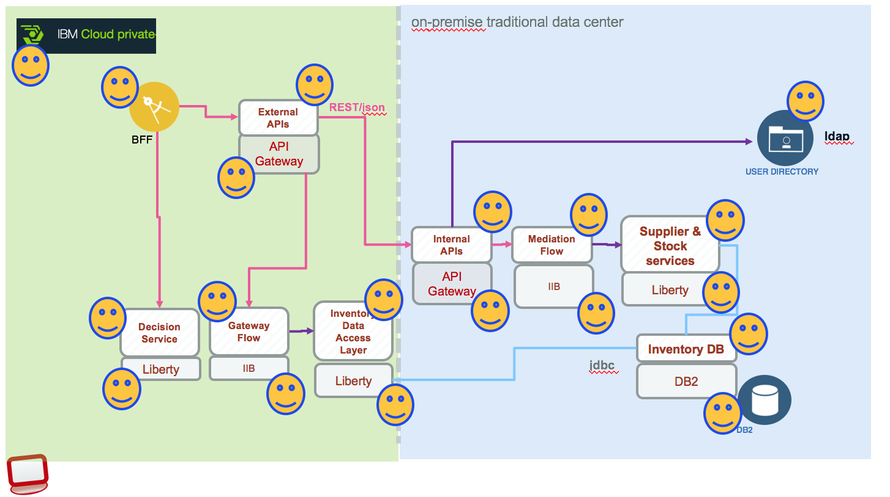

# Processing messaging with MQ, DSI and Conversation

## Use case
Paul is using the Brown Portal application and he cannot access inventory plus the old computer inventory management application, he is asking to the IT Support chat bot to get advise on what to do.

The bot identifies the intent is to access the Inventory plus application, so the response is to get application status. The orchestration layer is calling the ODM Decision Server Insight to get the status of the app via REST api. The application is degraded so the recommendation from the bot is to wait, put the email or userid of the impacted user into the list of impacted user so when the application is coming back online an email will be automatically sent to the user by ODM DSI.

So how DSI knows about the application status?

Inventory Plus is an application running on ICP and hybrid cloud and has a set of sub component and microservices as part of the solution. We are managing each component with APM. Here is a schema of the Inventory Plus application:

When one component is degraged APM sends a message to a topics managed by MQ manager deployed on ICP:

DSI subscribes to this topic and processes the message to change the state of the application.  

## MQ configuration

## Simulator of APM event

## APM configuration

## ODM DSI solution
The DSI solution is documented [here](./dsi/README.md)  
