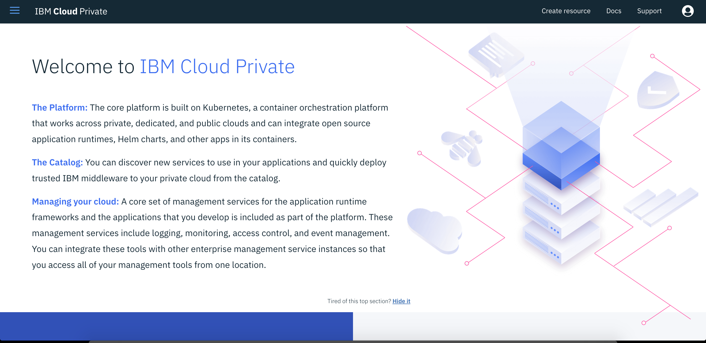
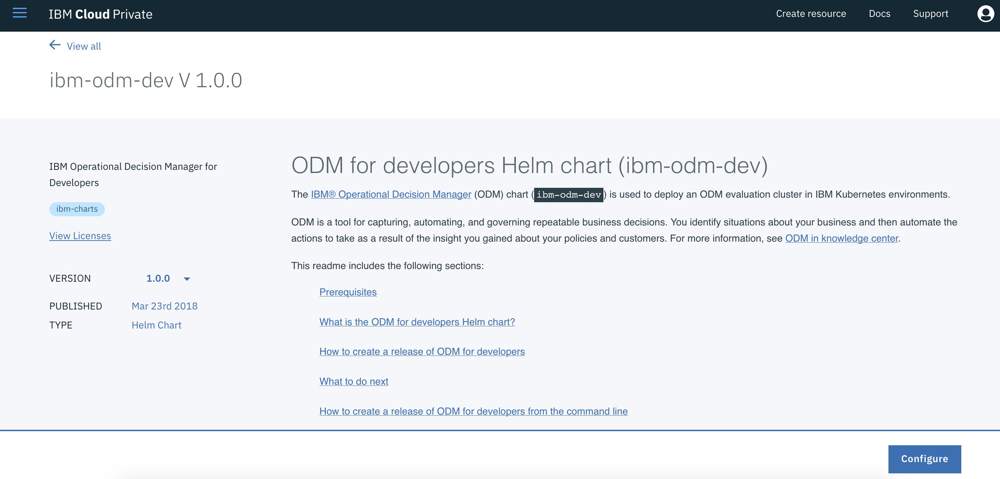
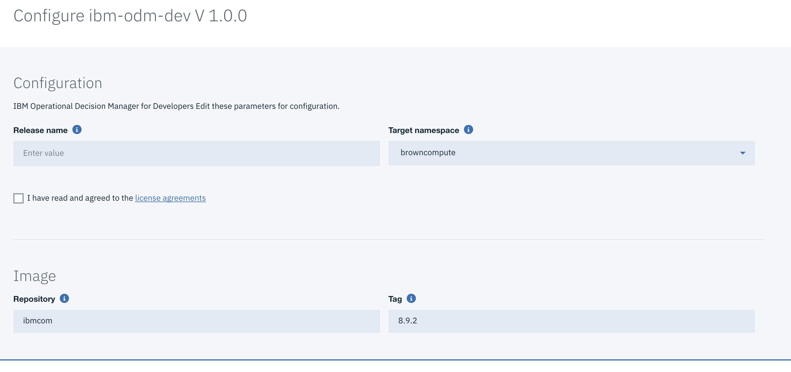
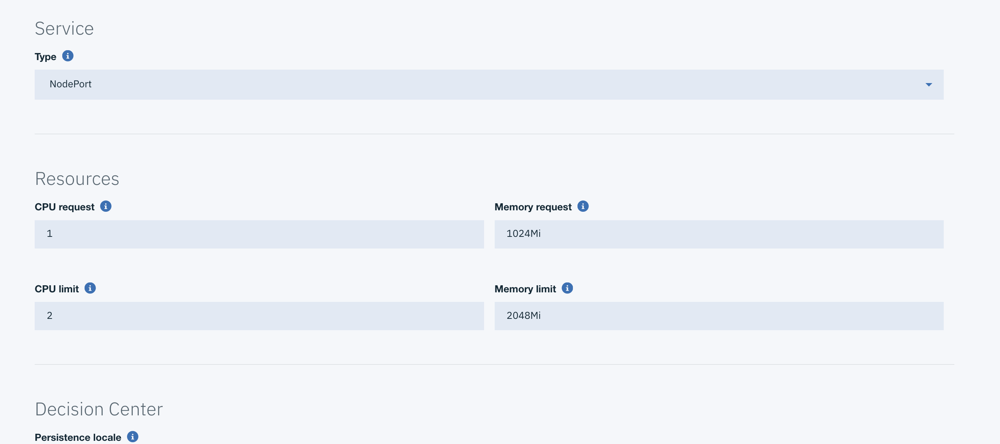
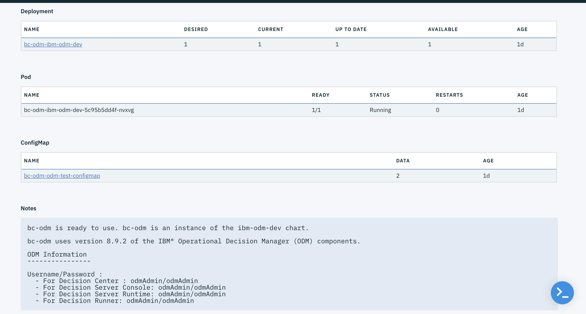
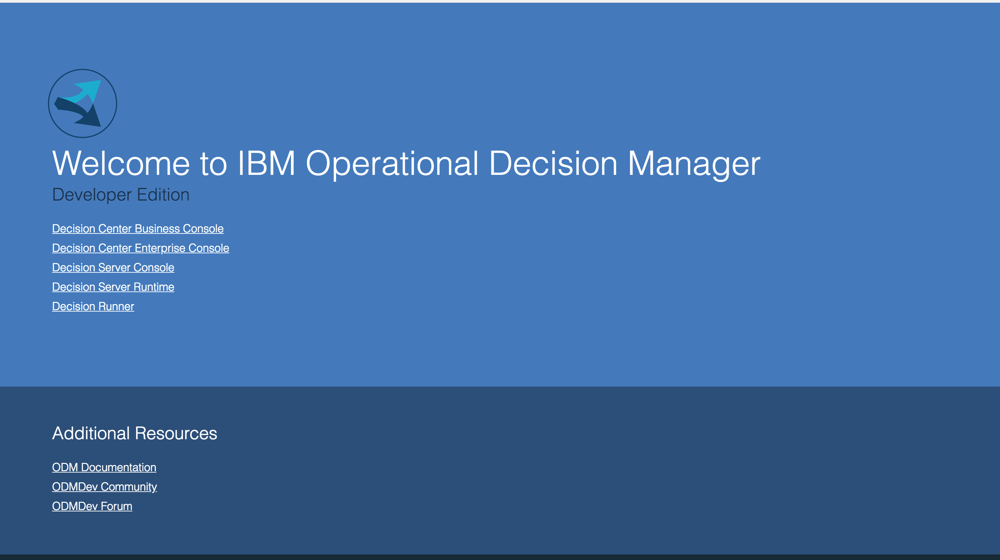
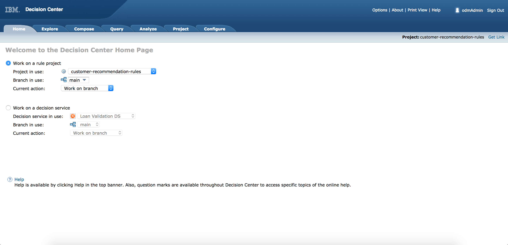
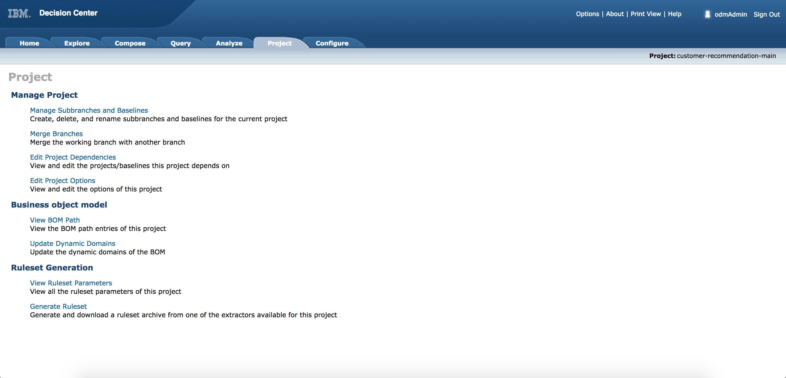
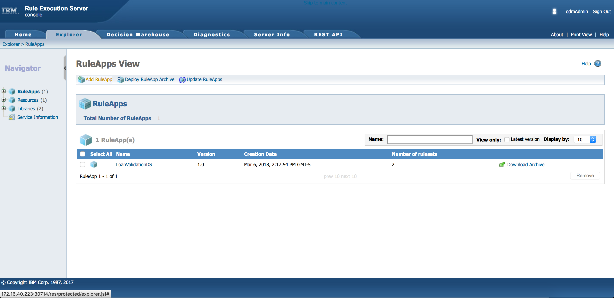

# ODM ICP and Ruleset Install

In this tutorial we will cover how to install ODM from our ICP Catalog onto our server, and install a previously generated ruleset.
## Target audiences
* ODM administrators or Operation staffs willing to understand the ODM deployment on kubernetes.
* Developers who want to get an environment up and running as quickly as possible.

## Requirements

 1. Access to an ICP cluster with ICP version 2.1.0.2 or later.
 2. Access to ICP Catalog with admin role
 3. A zip file of our Rules which can be found in [this project](https://github.com/ibm-cloud-architecture/refarch-cognitive-prod-recommendations) in the folder odm/rulesets/ProductRecommendation/output/

## Installing ODM on ICP
The first thing we will do is launch our ICP Dashboard

Next we will be selecting the dropdown from the right and select our catalog option

From there we will select our Helm Chart where we are installing ODM from, and run a search for ODM.

Here we can see we have found our ODM Package to install, next we select that package.

Next we shall read the documentation available. In this example we can gather important information such as the H2 Server needing 5 Gbs of Persistent storage. We will select configure to enter the necessary information

We will give our release name as bc-odm and then select our targeted namespace.

We do not need to change anything in the previous screen shot

We will be changing 2 things in the H2 Database.
 1. Check the Use dynamic Provisioning for Persistent volume so that it is enabled
 2. Change the 2 to a 5 for the Storage Size for persistent volume

No other changes are needed to be made for any other options. then click configure at the bottom

After receiving your successful message let's navigate to our dropdown and find our instance. Click the hamburger icon on left (three horizontal) bars, and then select workloads, and finally helm releases.  

Next find and select the ODM helm release. In our case it is `bc-odm`   

Now we can see the ODM helm release information: deployed namespace, service, deployment, pod... At the bottom we can view the userids and password to connect to each element of ODM. We can also see the instance we need to navigate to.

Select the link listed inside the `service` sub part to navigate to more details

Select the Node Port to navigate to the asset. This should take you to the ODM Home Page. Note that you may need to log in with associated info.

## Installing the Ruleset
The RuleApp was created and updated using Rule Designer, the developer tool. We want to expose the decision service in the Decision Center consoles so business users can browse the ruleset content, modify the business rules and tables and deploy the ruleset to the target runtime.
With ICP ODM deployment all those components are available for you: decision center, decision server, administration console.

### Adding the ruleset in decision center enterprise console
From here we will select the Decision Center Enterprise Console to Add our Rules.

Select Configure at the top right of the navigation bars

Select Import Projects to import our rule project. The Rule Project will look something like this but zipped

Next you can select the ODM Project to explore as seen here. I changed the dropdown to explore the ruleset, however to export let's change it back to customer-recommendation-main

Now Select project again to export the rule archive

And select our ruleset to export

Select OK and then download the jar archive that it responds with.

### Deploying ruleApp to execution runtime
Navigate back to our ODM Dashboard and select Decision Server Console

Select the Add RuleApp option

Fill out required information to create our new RuleApp

After this is done we will be attaching the necessary archived ruleset from the previous steps. Select Add Ruleset in the below screen

Please add the necessary information and attach the JAR that was previously downloaded

