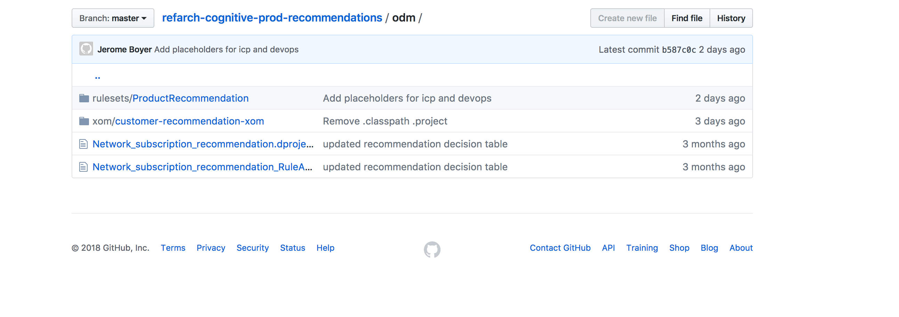
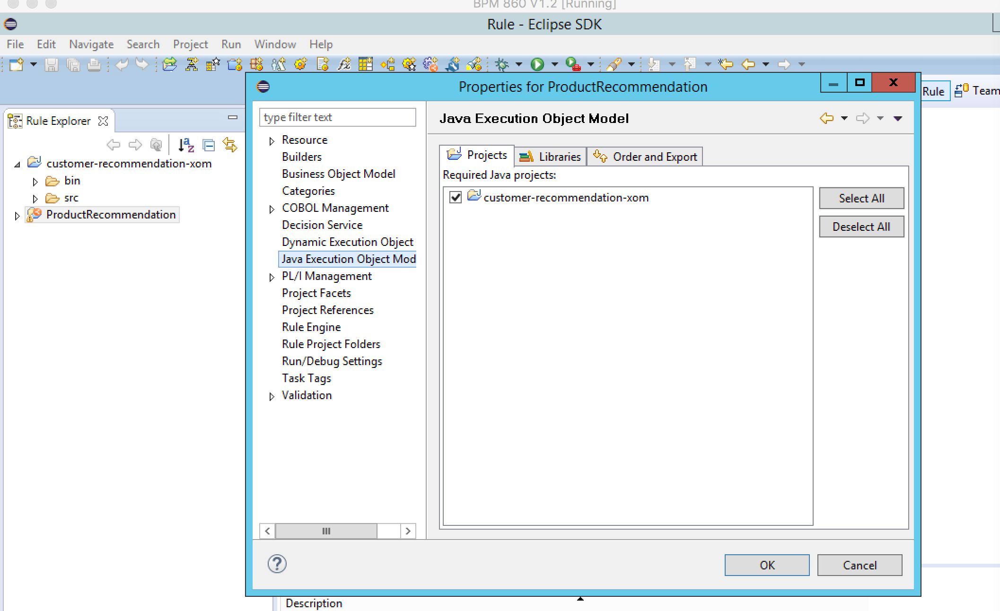
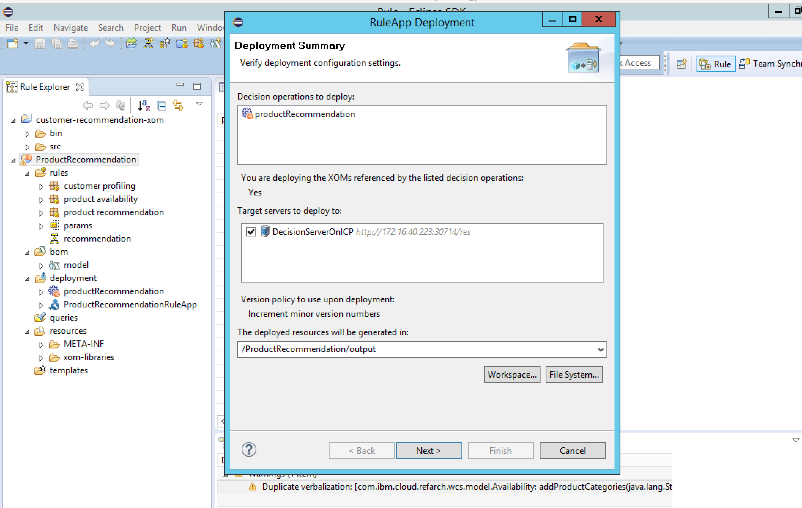

# Deploying Ruleset from Rule Designer

In this markdown file we will be walking through deploying the

## Environment set up
1. Download the required files, these are the top two shown below
 
2. Add them both into your Rule Designer development environment, import the Customer Recommendation XOM, we will use that as our BOM. The Product Recommendation is our main ruleset. 
3. Ensure that we have the proper dependencies for our project

4. Ensure your target is pointed correctly and continue with the deployment.  
5. Carry through the guided steps. We want to ensure our target server is the DecisionServerOnICP (ending with :port/res)
6. After the steps are completed successfully we want to navigate to our REST interface with the rule project and test with our sample request and verify we receive a correct response
