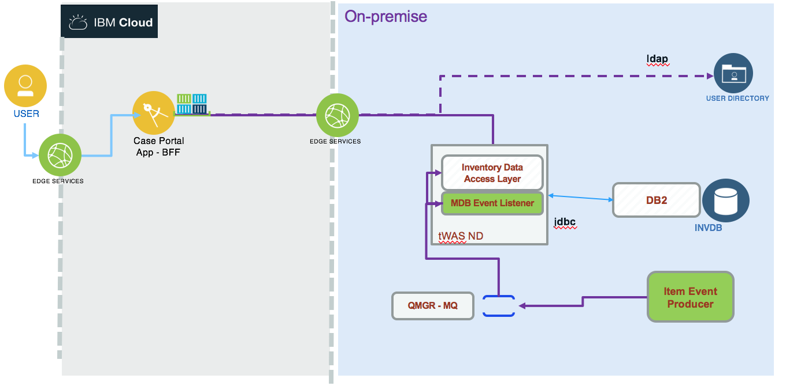
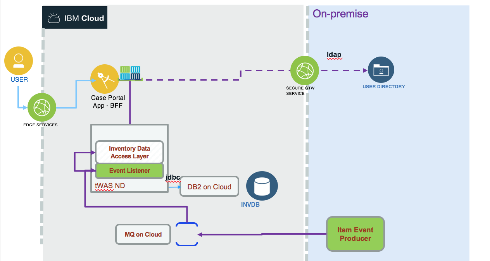

# Lift and shift an integration solution
In this article we are detailing how to migrate part of the 'hybrid solution' to a pure IBM Cloud deployment. The following diagram illustrates the starting environment:

where the components are:
* User interface is the current cloud native portal application done with Angular 6 and BFF with nodejs that we can deploy as a cloud foundry app, or as container on IBM Container service. (See [this project](https://github.com/ibm-cloud-architecture/refarch-caseportal-app) ).
* LDAP service for user authentication and role definition
* [Inventory data access layer](https://github.com/ibm-cloud-architecture/refarch-integration-inventory-dal) is a JEE app to expose SOAP interface implemented with JAXWS and JPA to support SOA service as data access layer to the inventory database. It is deployed to Traditional WebSphere Application Service (tWAS).
* [An inventory DB2](https://github.com/ibm-cloud-architecture/refarch-integration-inventory-db2) to persist items, suppliers and inventory data in DB2.
* Item event producer is a java application to simulate event created from warehouse about item added to an inventory in the given warehouse. This is an event sent as a message to a Queue defined in MQ.
* An event listener application implemented as a message driven bean deployed on tWAS. This application persists the date to the inventory database.

and the target environment will be using the same components but move DB, WAS app and MQ to IBM Cloud.

The MQ layer will be using two queue managers so investment done on MQ on-premise are not touched but workload is moved to cloud. MDB listen to queue defined on queue manager on Cloud.

## Db2 database migration
We are addressing this migration in [this note](https://github.com/ibm-cloud-architecture/refarch-integration-inventory-db2/blob/master/docs/db2-cloud.md)

## tWAS App lift and shift
We are using the same approach as detailed in [this tutorial](https://github.com/ibm-cloud-architecture/refarch-jee/tree/master/static/artifacts/WASaaS-tWAS-tutorial)

## MQ based messaging solution
The implementation of the messaging solution is done in [this repository](https://github.com/ibm-cloud-architecture/refarch-mq-messaging)

< TBD>
