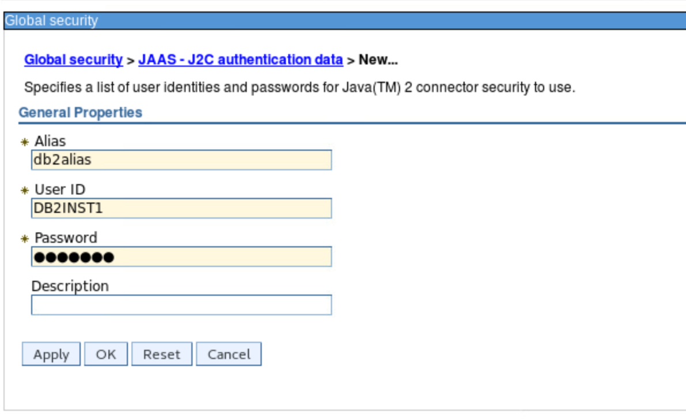
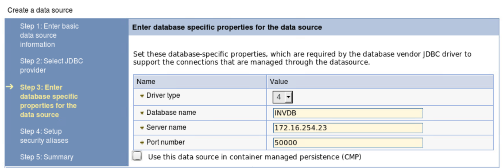
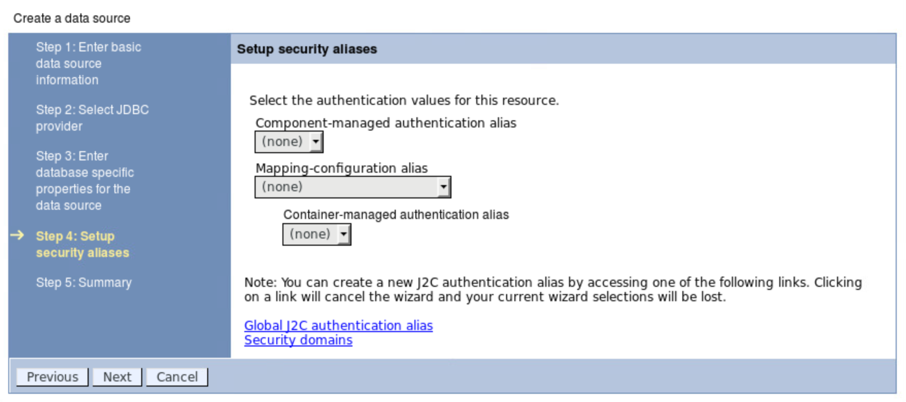
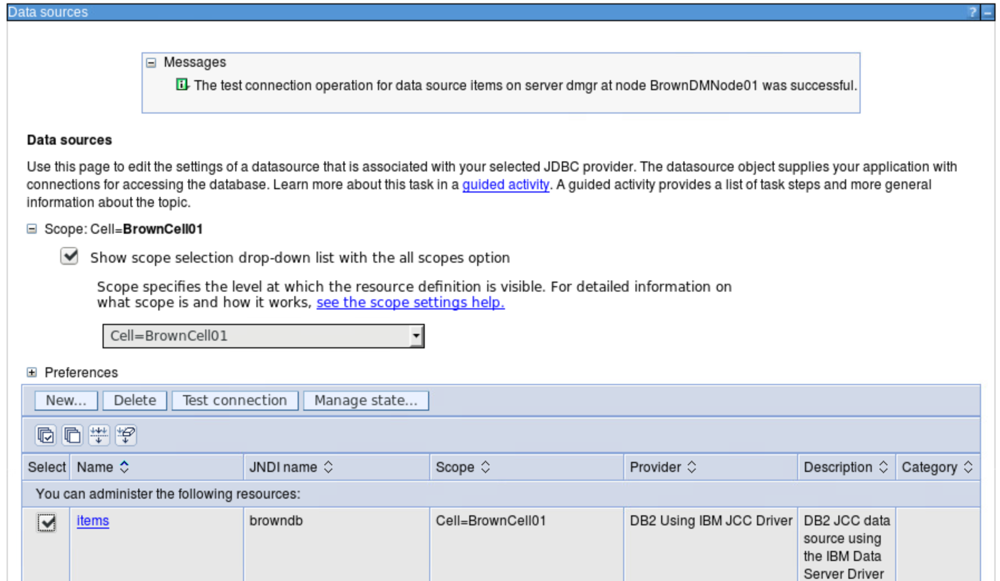

# Configure resources in WebSphere Application Server

## DB2 access for tWAS deployed on-premise
To access DB2 from a JEE application we need to define:
* a DB provider which defines what jars to load for JDBC connection
* a user id and password credential as J2C
* a data source to reference the target database inside DB2.

You need to be logged as an administrator user to the IBM Console.

### JDBC Provider
You need to get your db2jcc jar file from DB2 server and copy it somewhere under the WAS install folder on the WAS server.

1. Click on Resources -> JDBC -> JDBC Provider -> New
 

 You can select a scope at the Node or Cluster level depending of the deployment and high availability requirements.

1. Complete the JDBC Provider Fields.

 Database type : DB2
 Provider type: DB2 Using IBM  JCC Driver
 Implementation type: you can select XA (for a two-phases commit) or connection pool data source for one-phase commit.

 

1. Specify the class path to access the jdbc jar file and the jar name.

 

### User authentication

Create JAAS – J2C authentication Data specifying DB2 username and password for Container Connection:

1. Click on Security -> Global security -> Java Authentication and Authorization Service:

 

1. Add a new entry for the DB2INST1 user:

 

### Data source
Create a data sources for the 'Items / inventory' database.

1. Click on Resources -> JDBC -> Data sources, select the cell scope and new button.

     

1. Enter name and JNDI name to be used. See the application descriptor for getting the JNDI name.

 

1. Select the JNDC provider as defined in previous step:

  

1. Enter database specific properties like database name, IP address or dns name for the DB@ server and the port number it listens to connection:

  

1.  Select the 'db2alias' you created previously for the container-managed authentication alias:

   

1. Save the configuration and then `Test connection`. You should get a successful connection:

   
