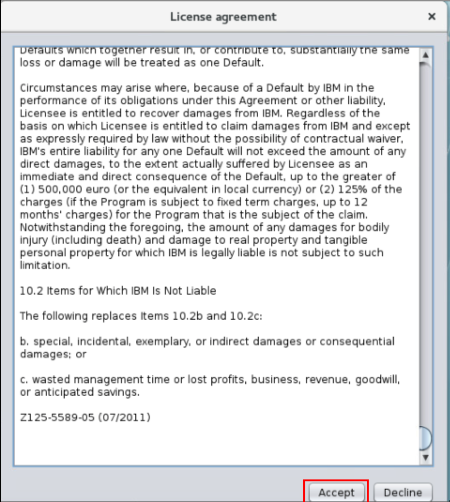
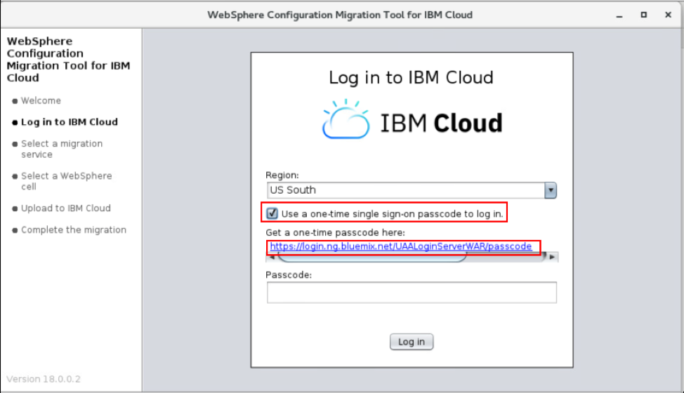
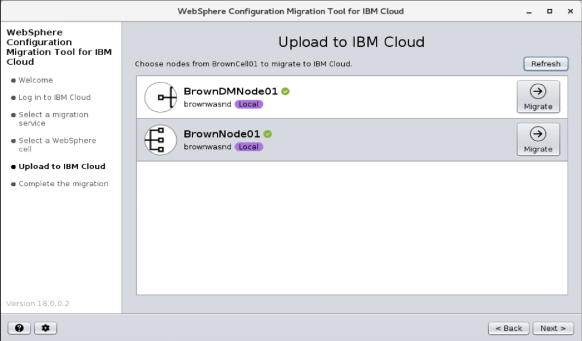
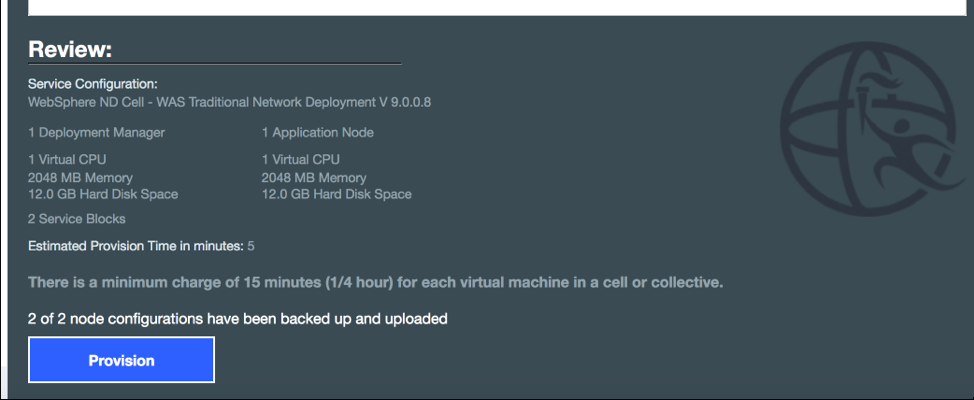
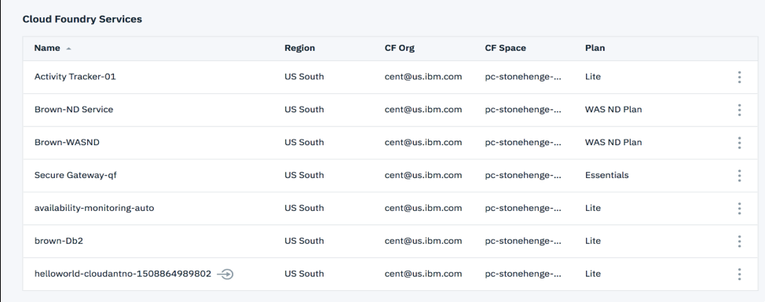
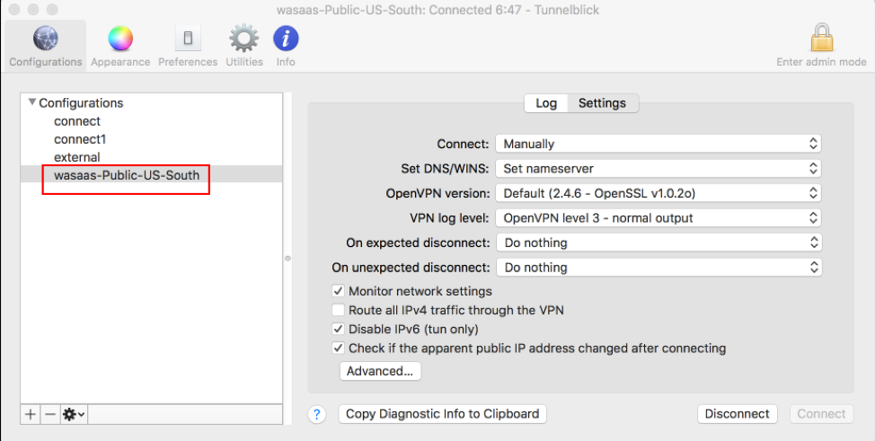
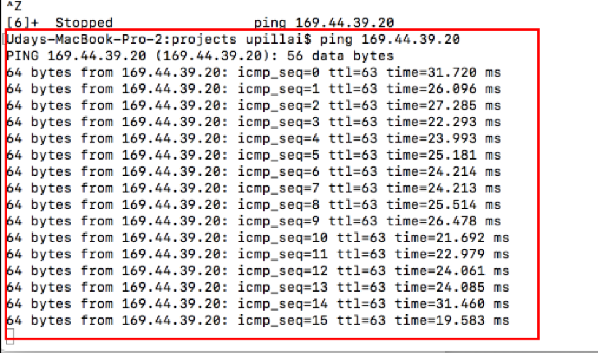
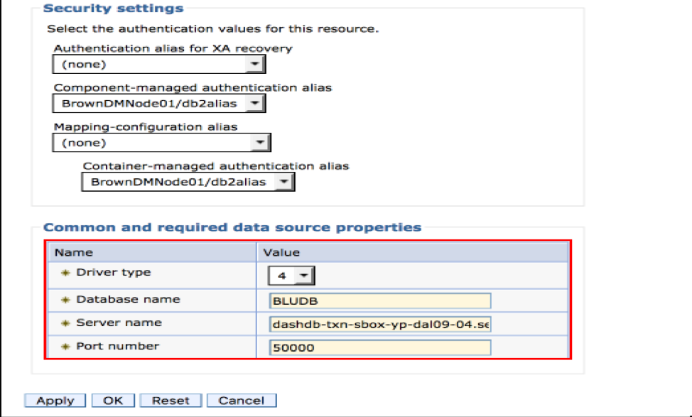
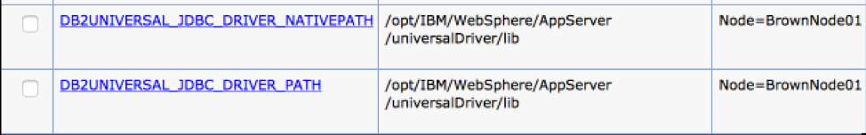
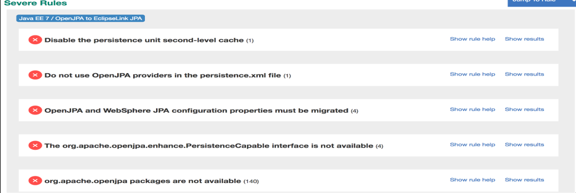

# Lift and shift
This tutorial will demonstrate how to lift and shift WebSphere workload running on-premises to IBM public cloud. When move to Cloud you will be on the latest version of the WebSphere platform available on Cloud.  For this scenario, we are using an On-premise workload running on WebSphere version 8.5.5.13 and the Cloud WebSphere version is running on version 9.x.
On completing this tutorial, you will learn the steps required to successfully migrate applications to cloud.

## Pre-requisites
* An IBM public cloud account
* Access to On-premise WebSphere environment
* Access to WebSphere Configuration Migration Tool


## Install WebSphere Configuration Migration Tool (WCMT)
Download the WebSphere Configuration Migration Tool for IBM Cloud and install it by unzipping it to a directory of your choice. For this scenario we installed the configuration migration tool on the same system  where the WebSphere workload  is running.
[https://developer.ibm.com/wasdev/downloads/#asset/tools-WebSphere_Configuration_Migration_Tool_for_IBM_Cloud](https://developer.ibm.com/wasdev/downloads/#asset/tools-WebSphere_Configuration_Migration_Tool_for_IBM_Cloud)

</img>

Note: Set the `JAVA_HOME` environment variable to a version of Java 7 or higher. Also pre-pend the `$JAVA_HOME/bin` directory to your system path. To run the tool, use the following command:
```
java -jar CloudMigration.jar
```
</img>

When you run the tool for the first time you will be prompted to set the language and then to accept the license agreement.

</img>


</img>

Select to use one-time single sign on and select the link below to collect the one time password.

</img>

Enter the passcode obtained from the link and click login

</img>

On the successful login page click  ‘Next ‘

</img>

Select organization  and space and click  ‘New’

</img>


Enter a new name for the services and select the environment. Click create service

</img>

Click ‘Next’

</img>

Select the WebSphere Cell you want to migrate and click ‘Next’

</img>

Read the summary screen and click ‘continue’

</img>

Click the migrate button for the profiles to migrate to Cloud.  For this scenario, we select both Deployment manager and node profile for migration.

</img>

Provide the admin credentials to gather the profile configurations and click upload. You can click migrate button for all the profiles in parallel.

</img>

Click the link in the “Complete the migration screen” to go to the provisioning window in Cloud. Also you can bookmark the provision the environment later.

</img>

Click the ‘Finish button’ to close window.

</img>

Select traditional cell

GO down and select the size of your Deployment manager VM

</img>

Select the number and size of the nodes

</img>

</img>

Review summary and click provision

</img>

</img>


### Post Lift and Shift activities

* Open the service from the Cloud Dashboard and verify the information
* Configure the VPN connection
* Gather login credential to systems
* Open the ports on WAS servers to connect to internal services and external systems
* Verify the connection to third party systems such as Database server
* Logon to WebSphere console and verify the migrated configuration
* Reconfigure the data source to connect to Cloud Database and validate
* Review the binary scan report, make the updates recommended and redeploy the applications
* Validate the application

### Open the service from the Cloud Dashboard and verify the information

Find the service (Brown-WASND) from the dashboard and open it by clicking on it.

</img>

Verify the information

</img>

</img>

</img>

</img>

### Configure the VPN connection
Click on your service ‘Brown-WASND’ service on your cloud dashboard.
Follow the VPN instructions and download the VPN configuration to connect to the Cloud.

</img>

Using ‘Tunnelblick’ on my desktop to connect to US-South Public Cloud.

</img>

Verify the connection by pinging from your terminal window

</img>

### Gather the credentials required

* Next step is to capture the login credentials (root , WebSphere console login ,etc) from the dashboard for all WebSphere systems.

* Gather the ports WebSphere processes using from : /opt/IBM/WebSphere/Profiles/BrownDM01/logs/AboutThisMigratedProfile.txt

</img>

</img>

SSH to the server as root user
```
Eg : ssh  root@ 169.55.3.25
```

Note down the ports for the deployment manager from /opt/IBM/WebSphere/Profiles/BrownDM01/logs/AboutThisMigratedProfile.txt

</img>

#### Open the ports on WAS servers to connect to internal services and external systems

Logon to the WAS servers:  ssh  root@ 169.55.3.25
Change directory to: /opt/IBM/WebSphere/AppServer/virtual/bin
```
drwxrwxr-x 2 virtuser admingroup 4096 Aug 30 18:25 .
drwxrwxr-x 3 virtuser admingroup 4096 Aug 30 18:25 ..
-rwxrwxr-x 1 virtuser admingroup 1604 Aug 30 18:25 federate.sh
-rwxrwxr-x 1 virtuser admingroup 1897 Aug 30 18:25 openFirewallPorts.sh
-rwxrwxr-x 1 virtuser admingroup 1667 Aug 30 18:25 openWASPorts.sh

Execute: ./openWASPorts.sh

Execute: ./openFirewallPorts.sh to open ports to other systems like database or LDAP servers

Eg: ./openFirewallPorts.sh –ports 50000 –persist true
```

#### Verify the connection to third party systems such as the Cloud database instance

For this lift and shift scenario we are using a Db2 on Cloud instance running on Bluemix

Database details:
```
hostname: dashdb-txn-sbox-yp-dal09-04.services.dal.bluemix.net
User Id : vvb46996
password: ********
Database : BLUDB
port: 50000
```
Telnet to the DB server with the port to verify the connection.

</img>

#### Logon to WebSphere console and verify the migrated configuration

Logon to the WebSphere Console

</img>

Verify the version, server and applications got migrated

</img>

</img>

#### Reconfigure the data source to connect to Cloud Database and validate

Change the existing data source configuration to point to the Cloud database instance.

</img>

Check the JDBC driver Path and actual location of the jar files

</img>

</img>

Test the Data Source connection

</img>

#### Review the binary scan report, make the updates recommended and redeploy the applications

Highlights from the  binary scan report

</img>

</img>

</img>

Apply all the changes recommended under the ‘Severe Rules’ section and redeploy the application.
