# ODM ICP and Ruleset Install

In this tutorial we will cover how to install ODM from an ICP Catalog onto our kubernetes cluster, and deploy the product recommendations ruleset in the decision runner server.

Update: 08/24/2018
Author: Zach Silverstein

## Target audiences
* ODM administrators or Operation staffs willing to understand the ODM deployment on kubernetes.
* Developers who want to get an environment up and running as quickly as possible.

## Requirements

 1. Access to an ICP cluster with ICP version 2.1.0.2 or later (tested on 2.1.0.3).
 2. Access to ICP Catalog with admin role
 3. A zip file of our Rules which can be found in [the product recommendation  project](https://github.com/ibm-cloud-architecture/refarch-cognitive-prod-recommendations) in the folder odm/rulesets/ProductRecommendation/output/

## Installing ODM on ICP
The first thing we will do is launch our ICP Dashboard  
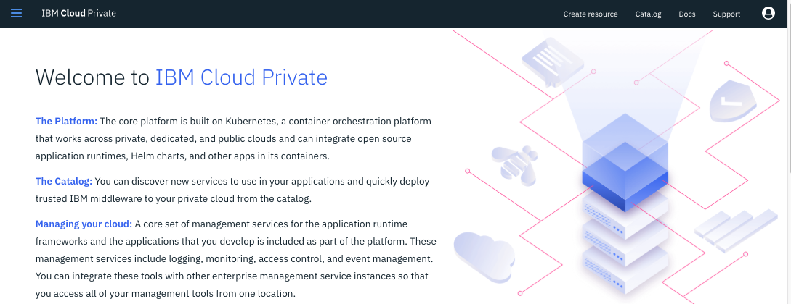

Next select the `catalog` link on the right of the top toolbar.  
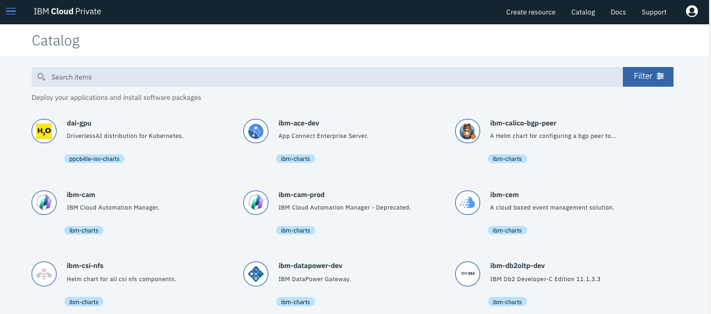

From there we will select our Helm Chart where we are installing ODM from, and run a search for ODM.
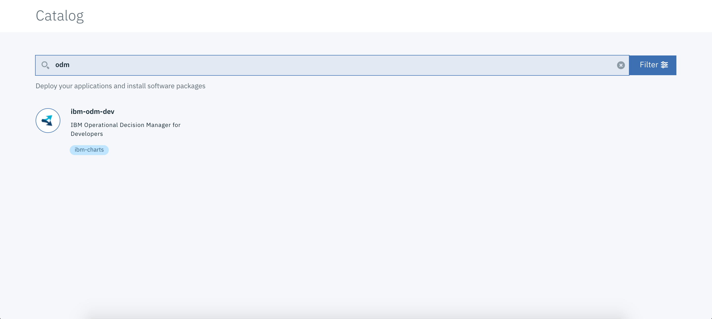

Here we can see we have found our ODM Package to install, next we select that package.

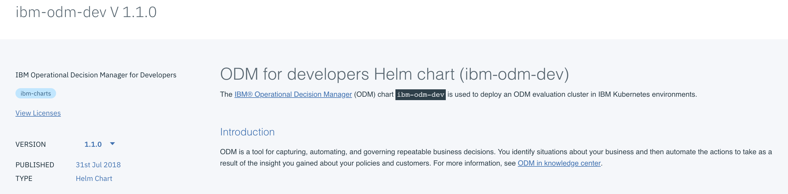

Next we shall read the documentation available. In this example we can gather important information such as the H2 Server needing 5 Gbs of Persistent storage. We will select configure to enter the necessary information

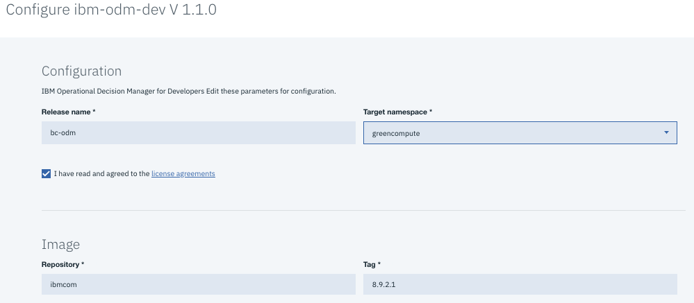

We will give our release name as bc-odm and then select our targeted namespace.

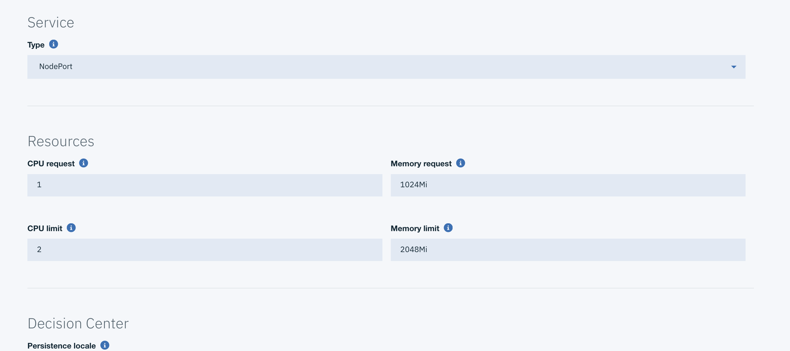

We do not need to change anything in the previous screen shot

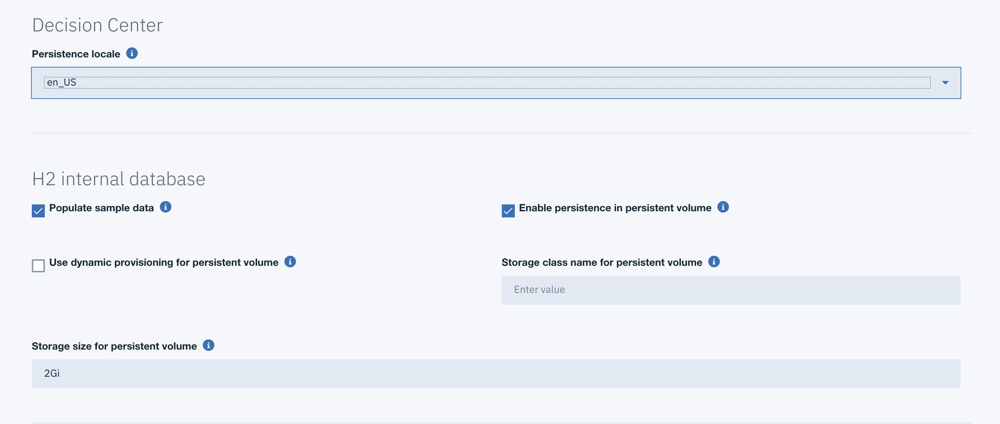

We will be changing 2 things in the H2 Database.
 1. You can let kubernetes try to provision a persistence volume automatically, therefore to do so check the Use dynamic Provisioning for Persistent volume so that it is enabled. If you prefer to control, create a PV with 5 G bytes storage, and a HostPath or NFS.
 2. Change the 2 to a 5 for the Storage Size for persistent volume

No other changes are needed to be made for any other options. then click `install` at the bottom

After receiving your successful message let's navigate to our dropdown and find our instance. Click the hamburger icon on left (three horizontal) bars, and then select workloads, and finally helm releases.  
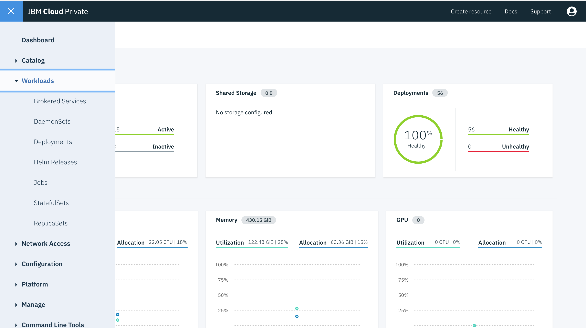

Next find and select the ODM helm release. In our case it is `bc-odm`   
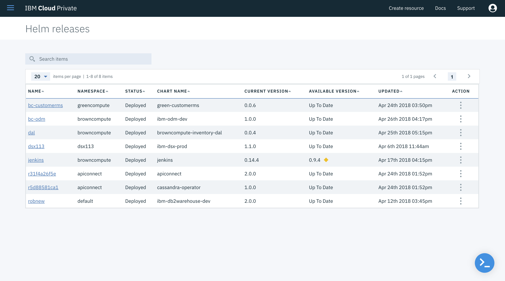

Now we can see the ODM helm release information: deployed namespace, service, deployment, pod... At the bottom we can view the userids and password to connect to each element of ODM. We can also see the instance we need to navigate to.

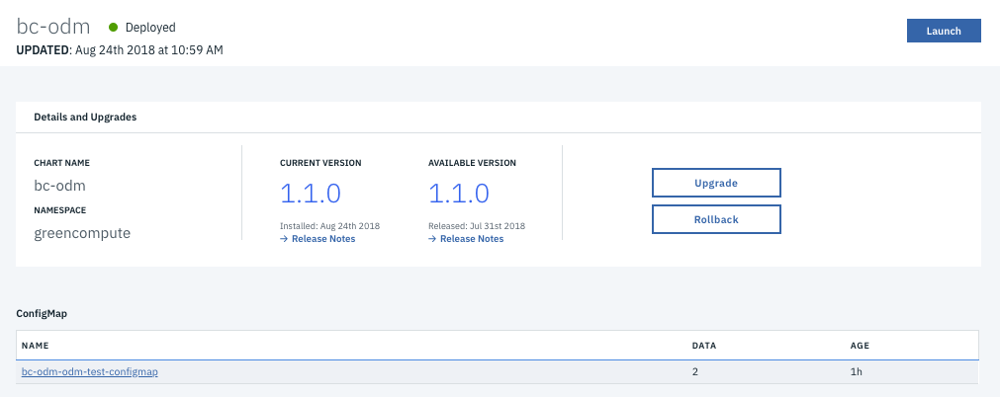

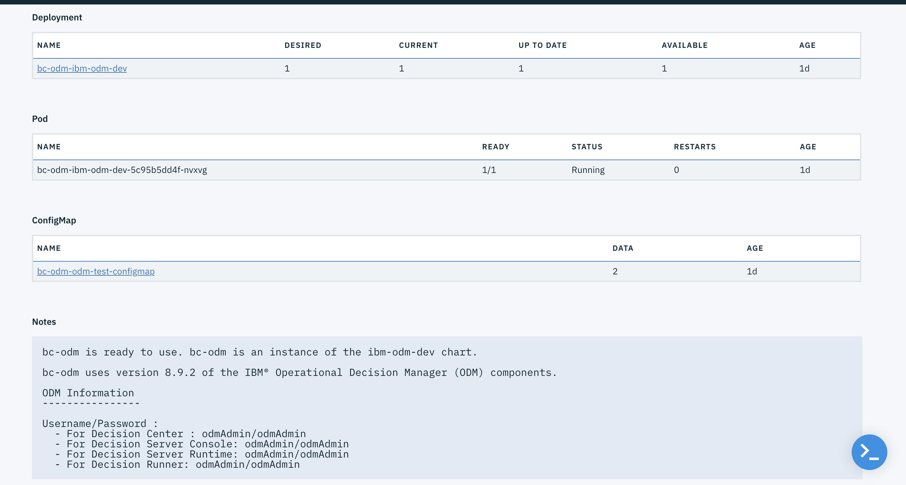

Select the link listed inside the `service` sub part to navigate to more details

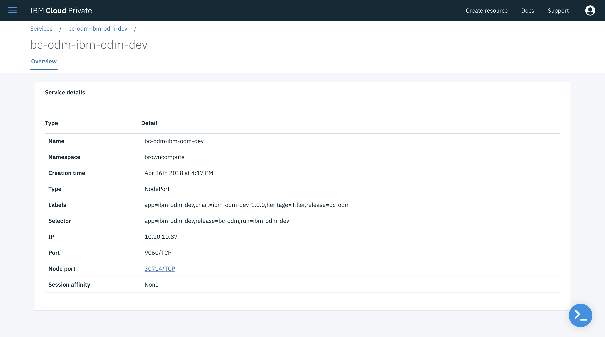

Select the Node Port to navigate to the asset. This should take you to the ODM Home Page. Note that you may need to log in with associated info.

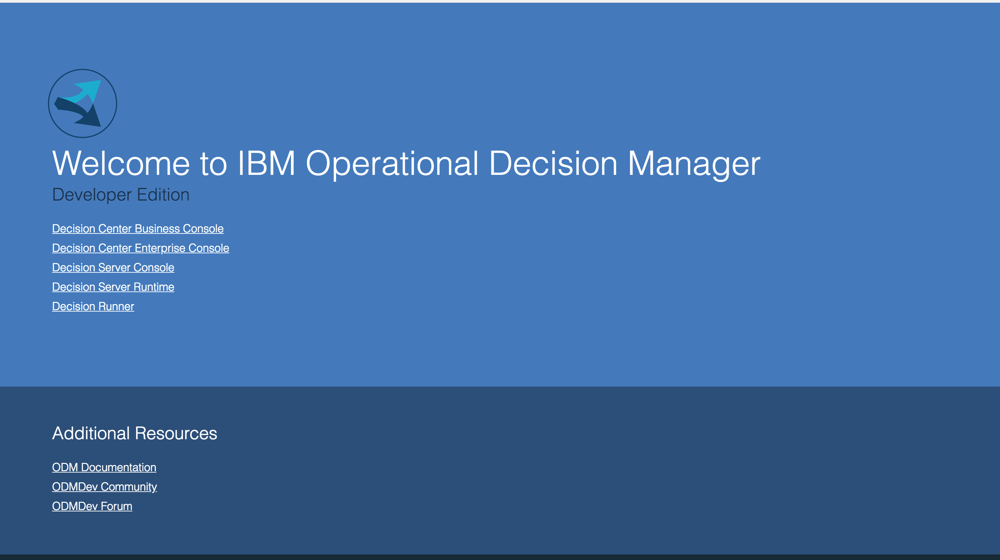

## Installing the Ruleset
The RuleApp was created and updated using Rule Designer, the developer tool. We want to expose the decision service in the Decision Center consoles so business users can browse the ruleset content, modify the business rules and tables and deploy the ruleset to the target runtime.
With ICP ODM deployment all those components are available for you: decision center, decision server, rule execution server administration console.

### Method 1 Deploying Rule App to RES via Rule Designer

1. Download the required files, these are the top two shown below. Ensure that the required .project and .ruleproject files are included 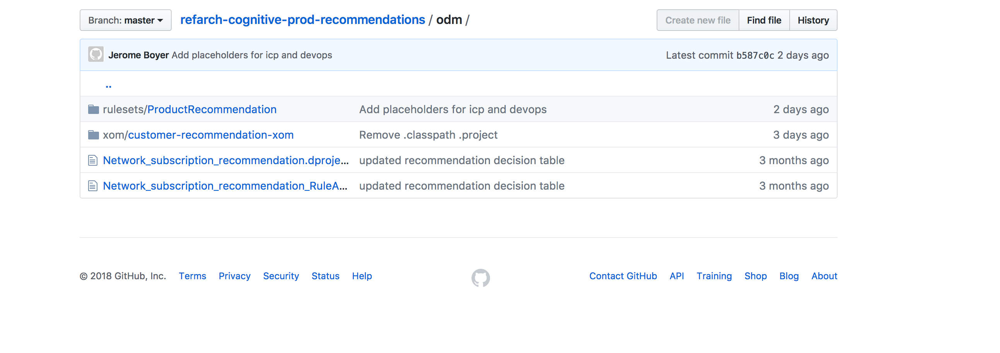

2. Add them both into your Rule Designer development environment, import the Customer Recommendation XOM, we will use that as our BOM. The Product Recommendation is our main ruleset. 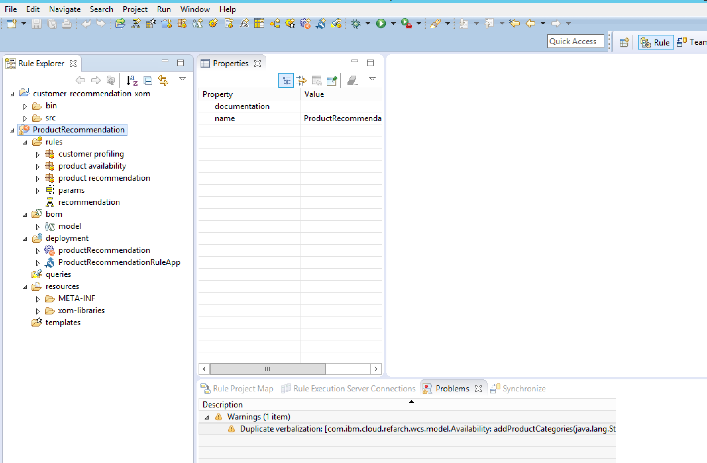

3. Ensure that we have the proper dependencies for our project
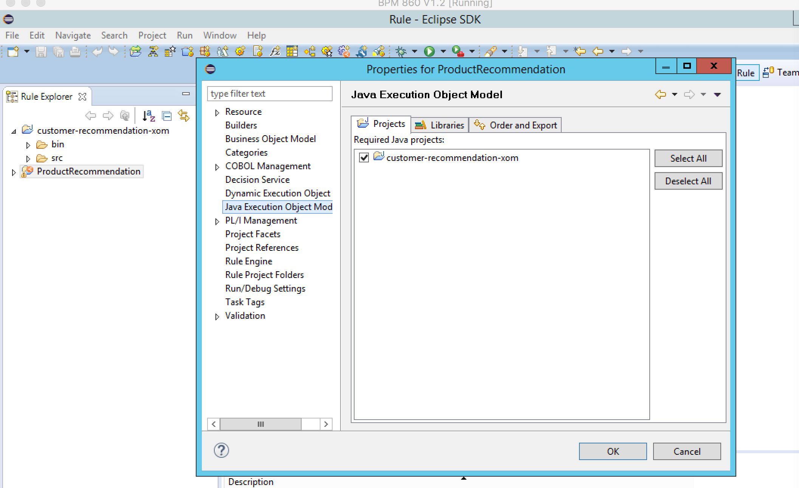

4. Create your link to the Rule Execution Server. 

5. Create your new deployment and set configuration options if you haven't already. Click Proceed to Rule App Deployment to push your Deployment to the RES 

6. You should see a message output inside our Rule Designer after a few moments 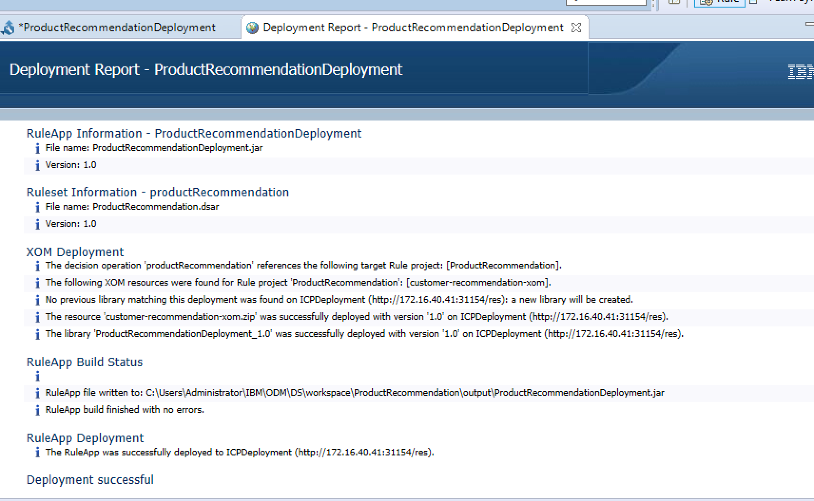

7. After the steps are completed successfully we want to navigate to our REST interface with the rule project, test with our sample request, and verify we receive a correct response 

  Find our sample XML Here <https://github.com/ibm-cloud-architecture/refarch-cognitive-prod-recommendations/blob/master/odm/rulesets/ProductRecommendation/TestRequest.xml>

### Method 2 Uploading Rule App to Decision Center Business Console and Deploying from there

* If you have already imported your project into Rule Designer, export the decision service 
* If you are using the rule service we have provided, download the required files, these are the top two shown below. Please be sure that when they are download they have the necessary .project and .ruleproject files 

1. Zip up a parent folder that includes the downloaded files 

2. Upload the packaged decision service to our Decision Center Business Console 

3. Ensure that the endpoint is set to our Rule Execution Server, and then deploy. 

4. You will see confirmation of a successful deployment and can then test inside our REST interface. 

  Find our sample XML Here <https://github.com/ibm-cloud-architecture/refarch-cognitive-prod-recommendations/blob/master/odm/rulesets/ProductRecommendation/TestRequest.xml>
